Follow this tutorial to learn how to use the Jetstream2 supercomputing facilities with your ACCESS credits. Learn to navigate Jetstream2's interface, set up VS Code, and use development containers inside Jetstream2!

## Introduction

Jetstream2 is one of the [many providers](https://allocations.access-ci.org/resources) of supercomputing services via the ACCESS program. It provides an easy to use interface to build and create instances in order to make use of your ACCESS Allocation Credits! In this tutorial we will cover how to access Jetstream2 and get started with basic development container environments in it!

{: .warning }
**Note:** Before you go through this tutorial, make sure that you *or*your faculty PI have completed an allocation request via ACCESS. General information about what is available can be found on the [NSF ACCESS website](https://allocations.access-ci.org/). If you need help, contact the [PSTAT Computing Committee](https://chat.google.com/room/AAAAR6wMcN0?cls=7).

- Accessing Jetstream2
- Adding SSH key
- Creating an instance
- Adding instance to VS Code

### Prereqs

- Have previously completed Step 2 of the [PSTAT User Account Sign-up](/docs/devcontainer/new-accounts/#1)
- [Basic container usage](/docs/devcontainer/basic-usage/) tutorial completed

### Useful Links

[Google Docs Version of Tutorial](https://docs.google.com/document/d/1jmfMKz30vkl2BcTW1tHSaQ1kPkbIwxjjdv2Vc0s4H5k)

## Accessing Jetstream2

1. Make sure that you have [created an ACCESS ID](https://operations.access-ci.org/identity/new-user). **For most users**, it is sufficient to "Register Without an Existing ID".

{: .warning }
**Note:** It is advised to use your school email when creating an account!

{: .warning }
**Note:** Be aware, it may take a little while for the ACCESS account creation to complete. If you run into any issues, contact [ACCESS support](https://support.access-ci.org/help-ticket).

2. Once you have been approved for an allocation request, head over to the [Jetstream2 website](https://jetstream-cloud.org/) and click "Jetstream2 Login":

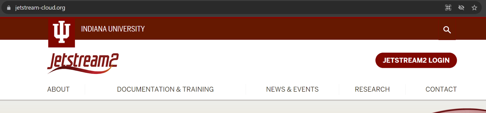

3. Click on "Add allocation":

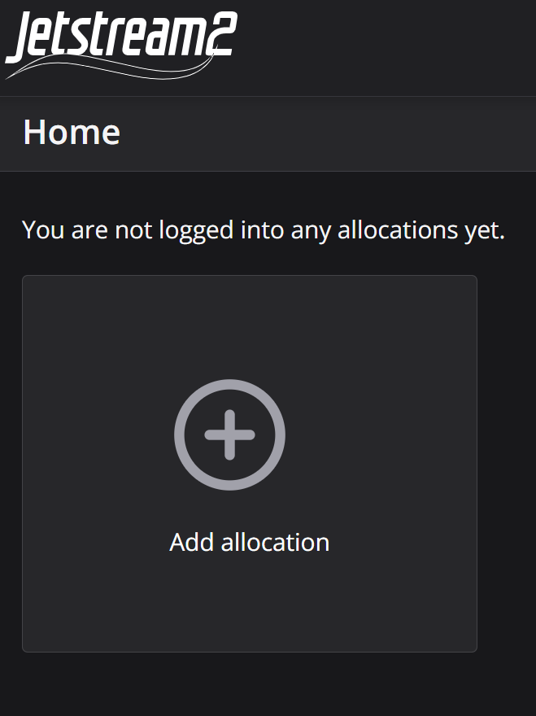

4. Click "Add ACCESS Account":

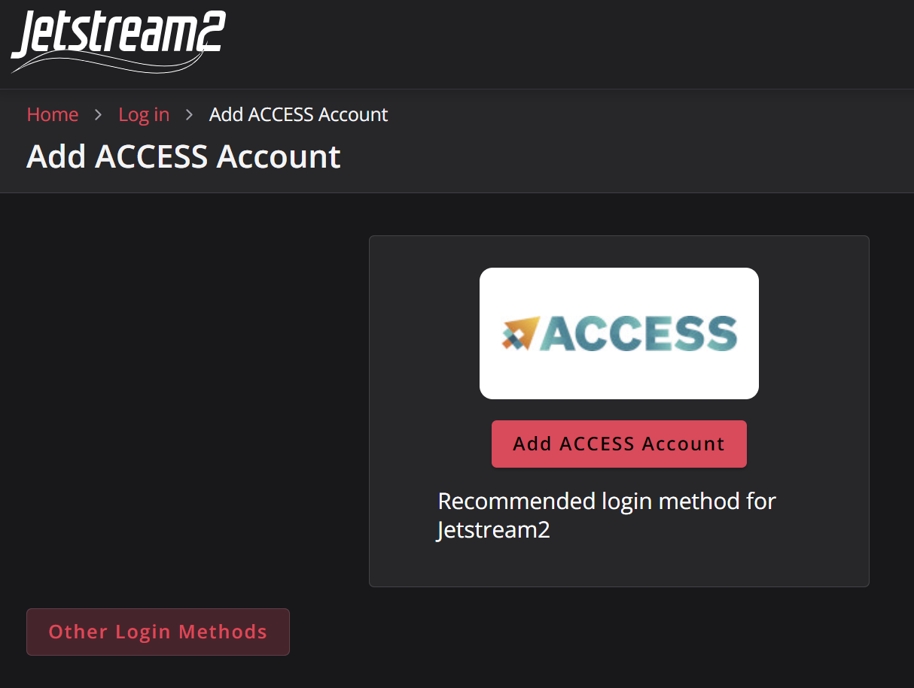

5. Complete the login. In the drop down menu select "University of California, Santa Barbara" (if creating an account with a UCSB email address):

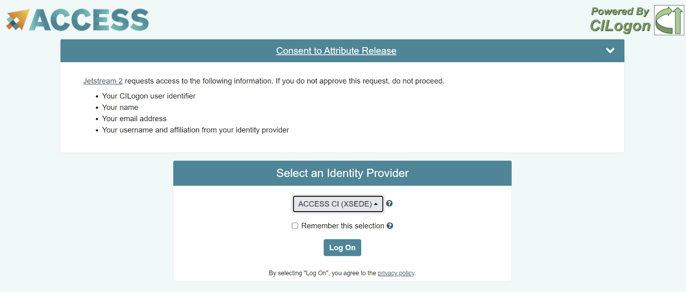

6. At this point, you will either see your allocation or will need to ask your PI to add credit allocations to your account. You should see something like this:

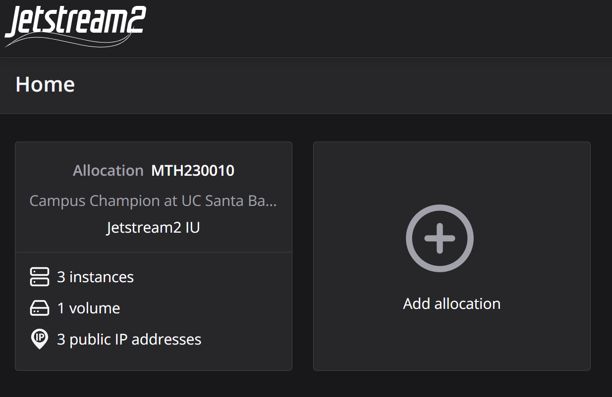

7. Click on the Allocation.

{: .note }
You are done! You will be greeted with the following window which contains all your compute instance management tools: 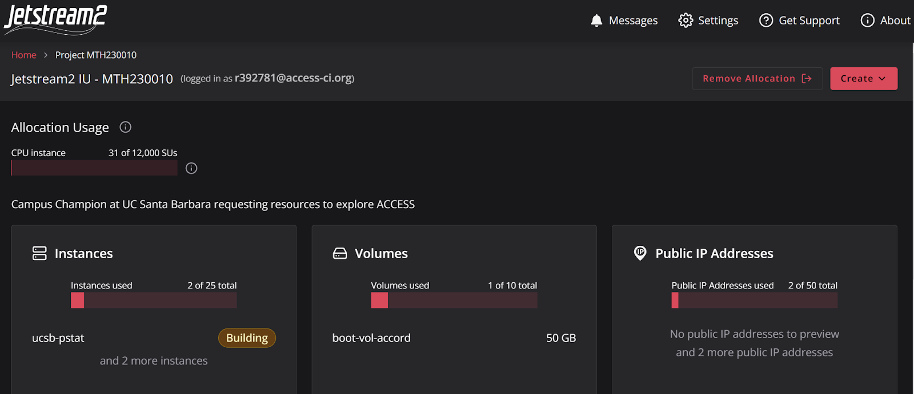

## Adding SSH Public Keys

{: .warning }
**Note:**This part requires completion of Step 2 of the [this tutorial](/docs/devcontainer/new-accounts/#1) in order to generate public keys for your personal computer.

Before we create our computing instances, it is best to add an SSH key that is associated with your personal computer. The reason for this is so that authenticating to Jetstream2 is made simpler without needing to use cumbersome passwords.

1. From your allocation menu, click "Create" -> "SSH Public Key":

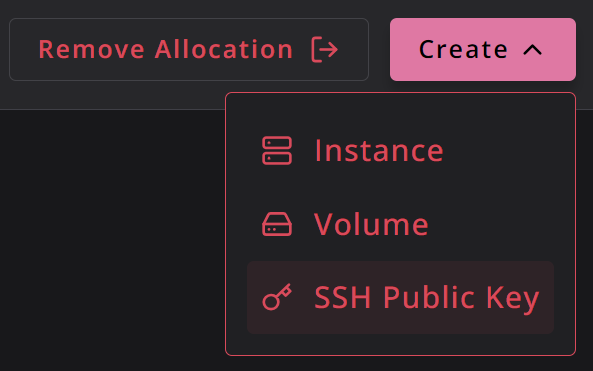

2. Name your key (e.g. my-laptop, my-desktop, etc.)
3. Open up your terminal and type in `code .ssh/<your-key-name>.pub` (where `<your-key-name>` is replaced with the name of the key you generated for your device). This will open up the public key file in VS Code and allow you to easily copy the contents. Another option is to use `cat .ssh/<your-key-name>.pub` and using your mouse to select the key and pressing `ctrl`/⌘ + `shift` + `c` to copy the key.

{: .warning }
**WARNING:** Make sure that you are copying a `<your-key-name>`**.pub** file. This is your public key. Do NOT copy the `<your-key-name>` (no extension) file, this is your private key and should be kept secret!

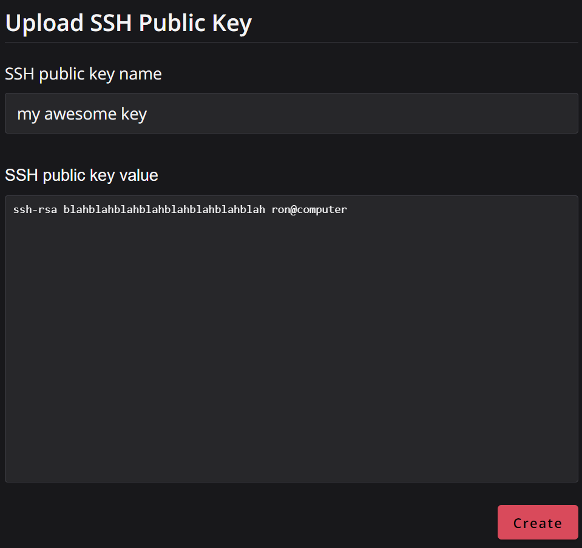

4. Click "Create"

{: .note }
You will now have your computer's public key added to Jetstream2. You will not need to use password authentication when accessing your compute instances!

## Creating Compute Instances

Jetstream2 makes it easy to create computing instances of various sizes. It is as simple as clicking "Create" -> "Instance" and selecting from the options provided. The PSTAT Computing Committee provides a community snapshot that will allow you to get started with an instance and development containers with ease!

1. From your allocation menu, click "Create" -> "Instance":

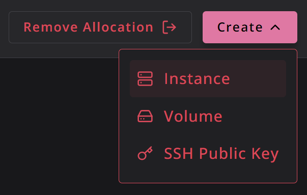

2. In the "Choose an Instance Source" window, select "By Image":

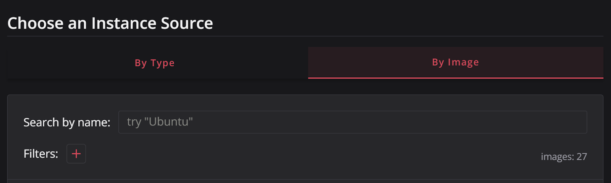

3. In the "Search by name" box, type "ucsb", you will see a **UCSB Computing Image** community snapshot pop up in the options. Click on "Create Instance":

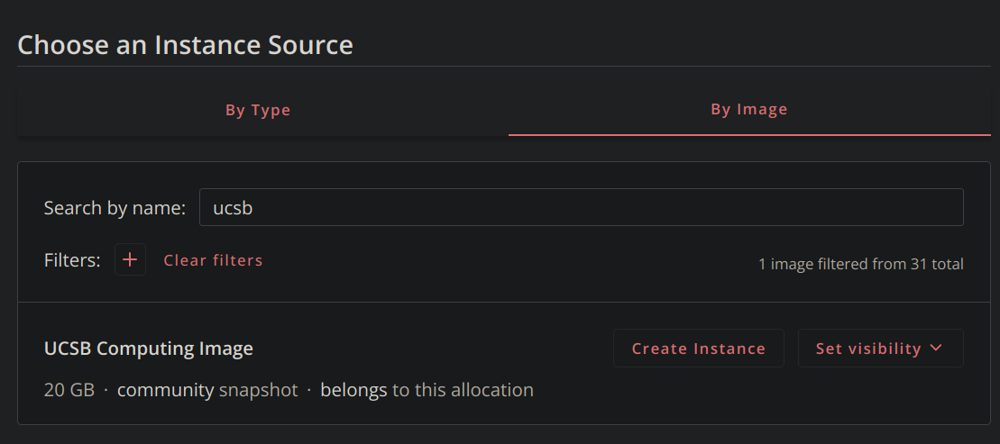

4. From here, select the size of your instance. **Be aware that bigger sizes will mean more credits spent per hour while in use!**

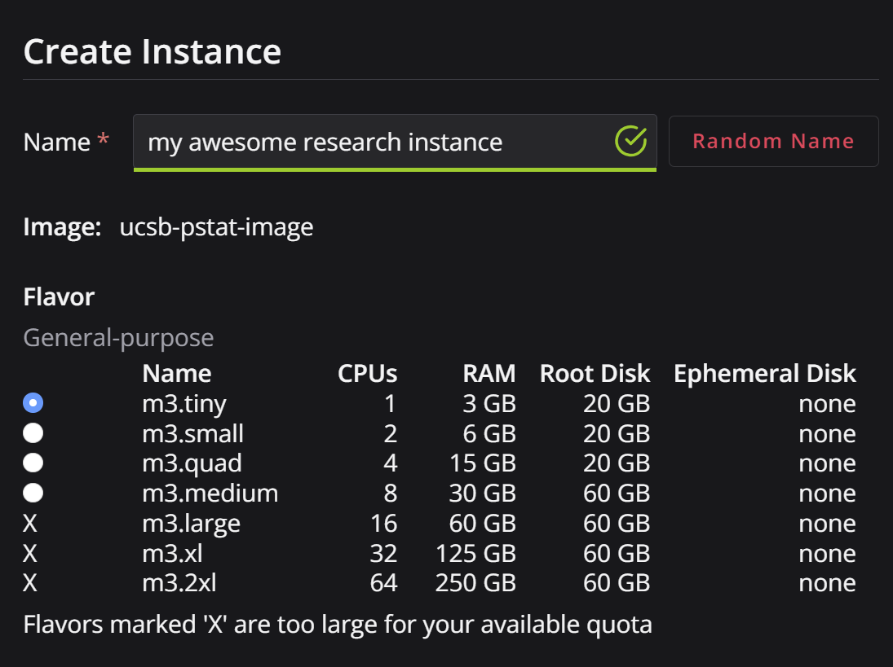

5. Select the size of your instance and number of instances if additional are needed.
6. Select "Yes" for "Enable web desktop":

7. Select the SSH key that you added in the previous tutorial step *or*click "Upload a new SSH public key" to add a new one:

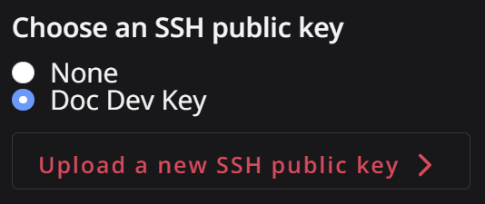

8. Lastly, hit create!

{: .note }
You will be taken to the homepage where you will see your instance being built! 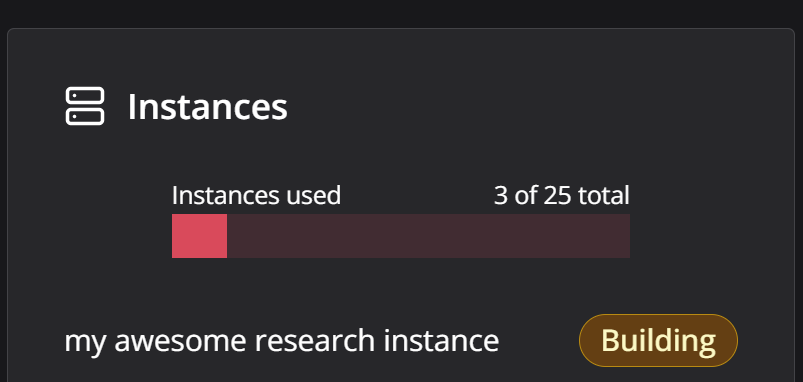

## Navigating Instances

Once your instance is built and setup, you will be able to dive straight in. We will show off some basic items to take note of in the web UI.

1. Click on the Instances box on the main menu:

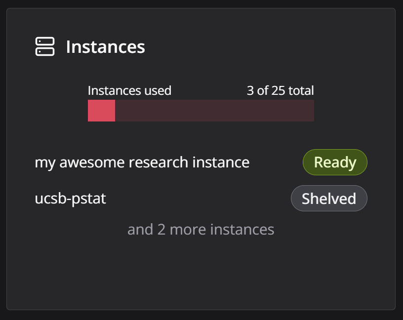

2. Inside you will see all your available instances. You have an option to immediately connect to the instance by clicking on "Connect to". Jetstream2 provides a web shell and desktop that you can access from within your browser to complete tasks. Feel free to explore these options; however, we will be focusing on using VS Code in the next part of this tutorial.

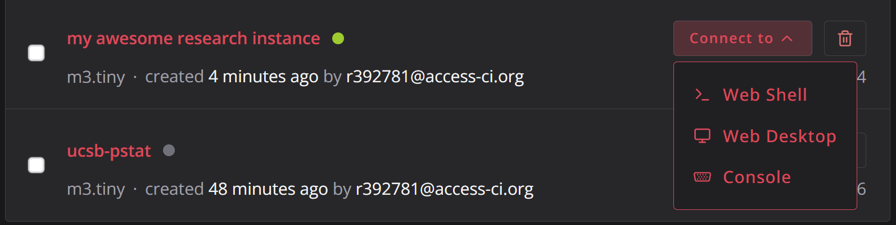

3. Click on the name of your instance (e.g. "my awesome research instance"). This will open up a page with all the details of your instance:

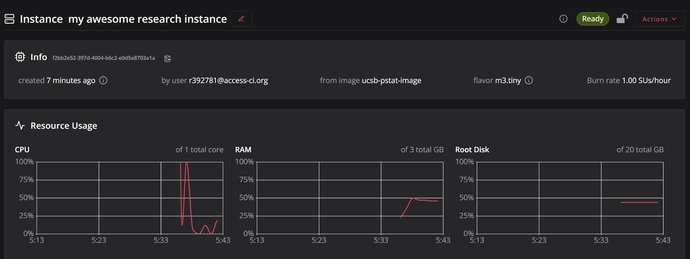

4. Scrolling around here, you will find various details and information about your instance. You can interact, attach volumes, create snapshots, etc. through here.
5. To resize an instance to a more powerful/less powerful one, click on "Actions" -> "Resize":

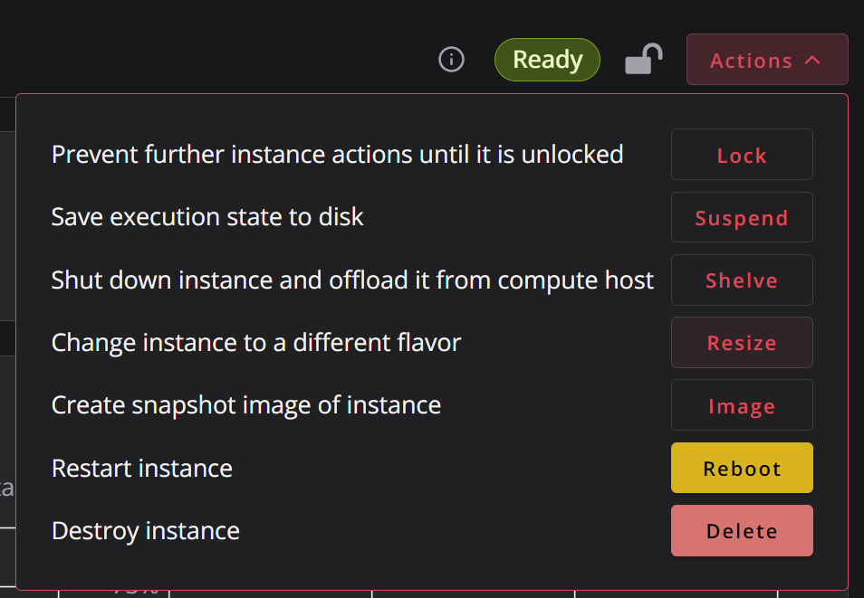

6. To shut down your instance click on "Actions" -> "Shelve":

{: .warning }
**WARNING:** Be sure to **shelve** your instance any time you are not using it to run your code/programs/etc. If you do not shelve your instance, **it will continue running and consume your allocation credits even if you're not doing anything!**

More advanced options are detailed in the [Jetstream2 documentation](https://docs.jetstream-cloud.org/general/instancemgt/).

## Developing with VS Code and Dev Containers

{: .warning }
**Note:** This part requires completion of [Dev Containers with VS Code](/docs/devcontainer/vscode-setup/) to have some familiarity with development containers.

Lastly, we will discuss using VS Code with your Jetstream2 instance and getting a quick start with a project development container that is available courtesy of the ucsb-pstat community snapshot image. Development containers allow you to easily port over your research code to an instance along with **all** the dependencies on languages, packages, and system tools. This requires minimal setup and no need of trying to get all your required tools installed on your own. the dependencies on languages, packages, and system tools. This requires minimal setup and no need of trying to get all your required tools installed on your own.

### Setting up VS Code

1. Open up your instance as shown in the previous section:

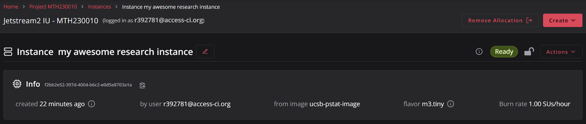

2. Scroll down and look for the "Interactions" box. Look for the "Native SSH" option and click the copy button next to it:

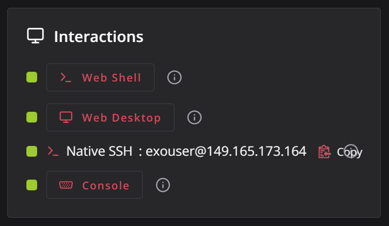

3. Open up VS Code. Click on the lower left green button for "Remote Connections":

4. The command palette will open. Go down the commands and select "Connect Current Window to Host..."

5. Select the 2nd to last option "Add New SSH Host..."

6. In the dialogue box, type in "ssh" and paste the "native ssh" instance that you copied earlier:

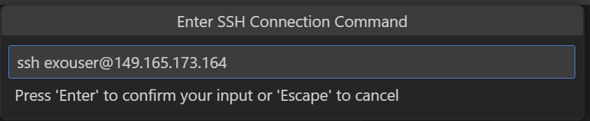

7. Select your default configuration file to update (under your computers username):

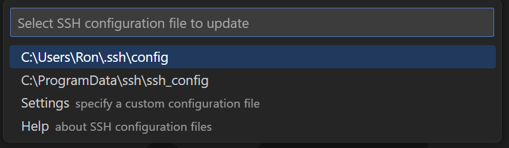

8. Click on "Config" to modify the name of the ssh host to be more user friendly and save it. Name it whatever you like e.g. my-awesome-jetstream2-instance:

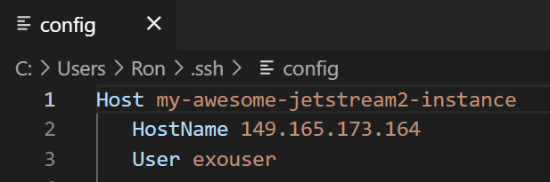

9. Click on the lower left green button again for Remote Connections. Select "Connect Current Window to Host...". Your newly configured host will pop up. Select it and let your instance load up.

{: .warning }
**Note:** You may get a pop-up box asking to choose whether you're using Linux, Windows, or Mac. **Select Linux**, since we are connecting to JetStream2 which uses the Linux operating system.

{: .note }
You are now connected! From here, you can follow the instructions to create a new project using [development containers](/docs/devcontainer/basic-usage/#2)!

## Conclusion

We covered connecting and setting up VS Code on Jetstream2. You are now ready to continue with your research work using this set up.

### Next Steps:

- [Jetstream2 documentation](https://docs.jetstream-cloud.org/general/instancemgt/)
- [Develop in Container](/docs/devcontainer#develop-in-container) tutorial lists

**Next up:** continue on to [the related wiki page](/docs/computing/external-sources#nsf-access-program).