Materials from the June 2024 Container-Driven Reproducible Research Computing workshop hosted by the PSTAT department.

## Introduction

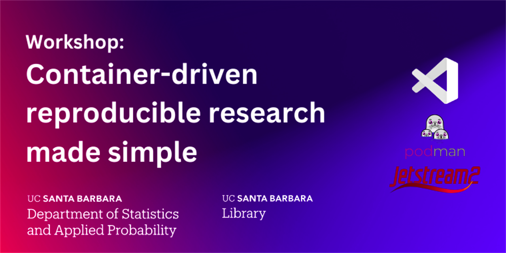


### Welcome to the Container-Driven Reproducible Research Computing Workshop!

In this workshop, we aim to solve common issues in data science like software installation, dependency management, and performance limitations of local machines. We will explore how to create reproducible and user-friendly research environments using development containers from inside a remote computing environment powered by Indiana University's Jetstream2.

### Workshop Overview

**I. Downloading Visual Studio Code**

- Install and set up Visual Studio Code (VS Code) as our main interface.

**II. Accessing a Remote Computing Instance**

- Set up SSH keys and connect to a powerful Jetstream2 compute instance.

**III. Creating and Managing Projects**

- Use VS Code to create and customize containerized environments.
- Deploy these environments with tools like JupyterLab and RStudio.
- Develop and package a small project using R, demonstrating the power of containerization for reproducibility.

**IV. Remote Computing and Resource Management**

- Understand and utilize resources provided by NSF ACCESS and Jetstream2 for your research.

**V. Distributing Research**

- Learn how to share your reproducible research environments through platforms like GitHub and Zenodo.


## Downloading Visual Studio Code

Before we begin, we will need to install Visual Studio Code (VS Code for short!) which is a powerful text editor that can be extended to be used as an integrated development environment for many languages.

1. Go to the [Visual Studio Code](https://code.visualstudio.com/) website.
2. Download the executable file for your operating system.
3. Open it and run through the installation.
4. Once installed, open up VS Code.
5. Click on the 4 square button to open up the "Extensions" explorer as seen here (alternatively, press `ctrl`/`⌘` + `shift` + `x`):

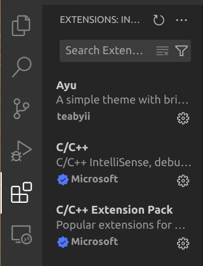


6. In the search bar search for "Dev Containers". Click on the extension authored by Microsoft and install:

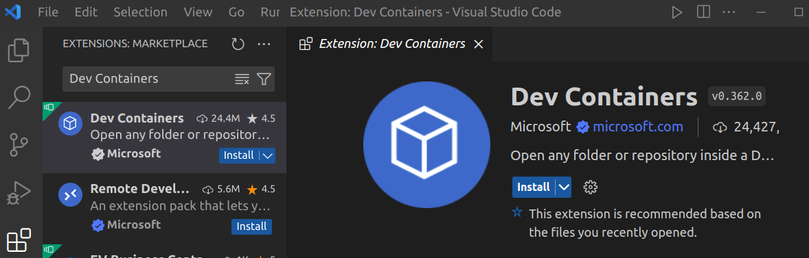


{: .note }
VS Code will be used as the main interface for various elements of this workshop such as remote computing servers, development containers, and tools found inside the containers!


## Connecting to Jetstream2 Instance

We have set up some computing instances for you to use on the Jetstream2 cluster that is run by Indiana University. In order to connect to your Jetstream2 compute instance we will need to first make sure that you can access your *Secure Shell (SSH)*, set up your SSH keys, and then connect to the remote compute instance.

{: .note }
**Note 1:** SSH works through public key cryptography which uses 2 keys - a public key which is given to a remote server and a private key which is kept locally on your laptop/desktop. To put simply, they are used to communicate between your laptop and server securely.

{: .note }
**Note 2:** For this workshop, you were sent a public (`container_workshop.pub`) and a private key (`container_workshop`). Click on the following buttons and save these keys in your **Downloads** folder to be used later on in this section: [Public Key](https://drive.google.com/file/d/1HyuCh6dM2FGSBLekYw5UmXGAzSQV7DSn/view?usp=sharing) [Private Key](https://drive.google.com/file/d/1sQF25kv7uwL1lyZMP3qodA2JA-g_lJRb/view?usp=sharing)

### Setting up SSH agent

In order to even get started with connecting to a remote server, we first need to make sure that the tools necessary to do so are up and running. Namely, we need to enable the SSH agent which handles authentication to remote connections. Once we do this, you'll be able to add the SSH key you've been given in order to connect to your computing instance!

There are 2 different sets of instructions to follow depending on your operating system but the end result will be the same!

#### Windows

1. Press Start and search for "Windows Powershell". Click on it to open a new shell.
2. Next, run the following code to create a directory called `.ssh` which will exist at the location found using the command `echo $HOME` in Powershell:

```
new-item $HOME\.ssh -ItemType Directory
```

{: .warning }
**Note:** You may get an error saying "new-item : An item with the specified name ...\.ssh already exists.". If you do, you can proceed to the next step since the directory is already there!

3. Verify that ssh-agent is running by searching for "Services" in the Start Menu:

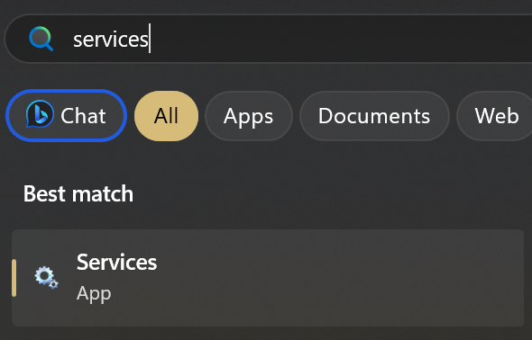


4. Search for "OpenSSH Agent" and make sure that the **Status is "Running"** and **Startup Type is "Automatic"**.


5. If this is not the case, right-click on the "OpenSSH Authentication Agent" entry -> select "Properties" -> Under "Service Status" select "Start" -> From the "Startup Type" drop down menu, select "Automatic".


6. In the penultimate step, you will need to download the `container_workshop.pub` public key and the `container_workshop` private key that were sent to you before the workshop. Save them in your "Downloads" folder. Once you've downloaded both of the keys, we will move them to the `.ssh` folder using the following command in powershell:

```
Move-Item -Path $HOME\Downloads\container_workshop.pub -Destination $HOME\.ssh\ Move-Item -Path $HOME\Downloads\container_workshop -Destination $HOME\.ssh\
```

7. Lastly, verify that your private key is added to your ssh-agent keyring by typing the following command in powershell:

```
ssh-add $HOME\.ssh\container_workshop
```

{: .warning }
**Note:** The output for this command should simply be "Identity Added ...". If you receive anything else such as a permissions error, try to run the following: **Windows:** `icacls "$HOME\.ssh\container_workshop" /inheritance:r` `icacls "$HOME\.ssh\container_workshop" /grant:r "$($env:USERNAME):(R)"` `icacls "$HOME\.ssh\container_workshop" /remove "Authenticated Users" "BUILTIN\Users"`

#### macOS/Linux

1. Find your terminal application and open up a new shell:

- macOS: `⌘` + `space`, then search "terminal"
- Ubuntu: `ctrl` + `alt` + `t`

2. Verify that your ssh-agent is running by using the following command:

```
eval "$(ssh-agent -s)"
```

{: .warning }
**Note:** Depending on your shell, you may need to use a different command or use elevated privileges through `sudo`: `sudo eval "$(ssh-agent -s)"`

4. In the penultimate step, you will need to download the `container_workshop.pub` public key and the `container_workshop` private key that were sent to you before the workshop. Save them in your "Downloads" folder. Once you've downloaded both of the keys, we will move them to the `.ssh` folder using the following command in terminal:

```
mv ~/Download/container_workshop.pub ~/.ssh/ mv ~/Download/container_workshop ~/.ssh/
```

5. Lastly, verify that your private key is added to your ssh-agent keyring by typing the following command in terminal:

```
ssh-add ~/.ssh/container_workshop
```

{: .warning }
**Note:** The output for this command should simply be "Identity Added ...". If you receive anything else such as a permissions error, try to run the following: **macOS/Linux:** `chmod 600 ~/.ssh/container_workshop`


## Connecting to Remote Server

Now that we have set up your SSH key and agent, it's time to connect to your Jetstream2 instance!

1. Before we begin, head over to this spreadsheet and claim a Jetstream2 instance by writing your name next to it... Keep the spreadsheet open as you will need to copy the instance information later!: [Jetstream2 Instances](https://docs.google.com/spreadsheets/d/11hU_z_t9LlG0Nyy34qpNsdAbR1SxPLB6T1DAwG6Yp9o/edit?usp=sharing)
2. Your window should look like this to start. In the bottom left hand corner you should see a  button. This is your remote connections manager. Click on it.

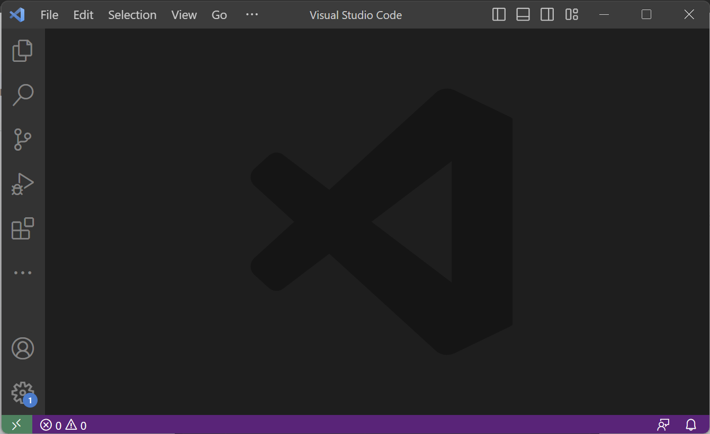


3. The command palette will open. Go down the commands and select " **Connect Current Window to Host...**" "

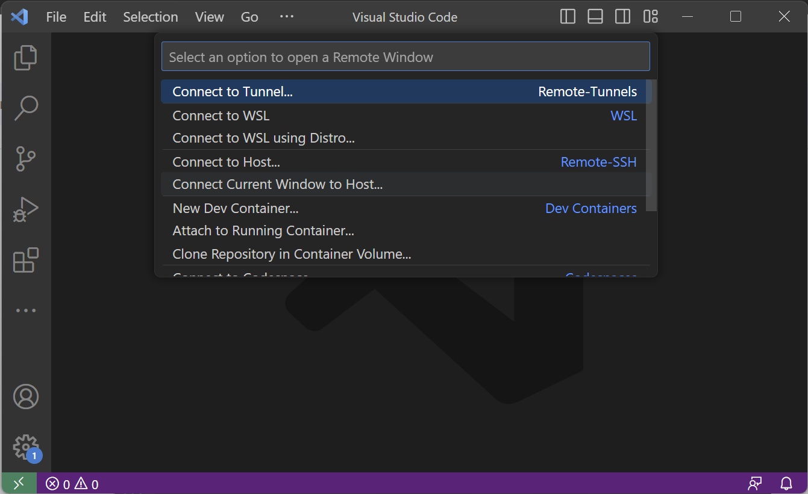


4. Select the 2nd to last option "Add New SSH Host..."


5. In the dialogue box, type in "ssh exouser@" and paste the instance name that you sign-up for in the spreadsheet:

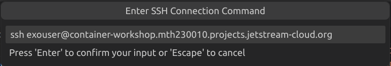


6. Select your default configuration file to update (under your computer's username):


7. Click on "Config" to modify the name of the "Host" to be more user friendly and save it. Name it whatever you like e.g. my-awesome-jetstream2-instance. In addition specify an `IdentityFile` which will be the name of the private key we saved ( `container_workshop`). Your final configuration should look similar to this: ). Your final configuration should look similar to this:

```
Host my-awesome-jetstream2-instance HostName container-workshop.mth230010.projects.jetstream-cloud.org User exouser IdentityFile container_workshop
```

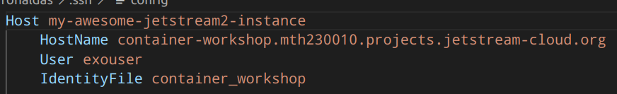


8. Click on the  button again for Remote Connections. Select "Connect Current Window to Host...". Your newly configured host will pop up. Select it and let your instance load up.

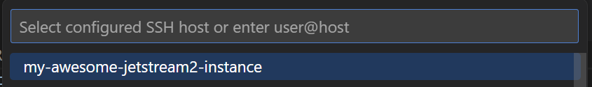


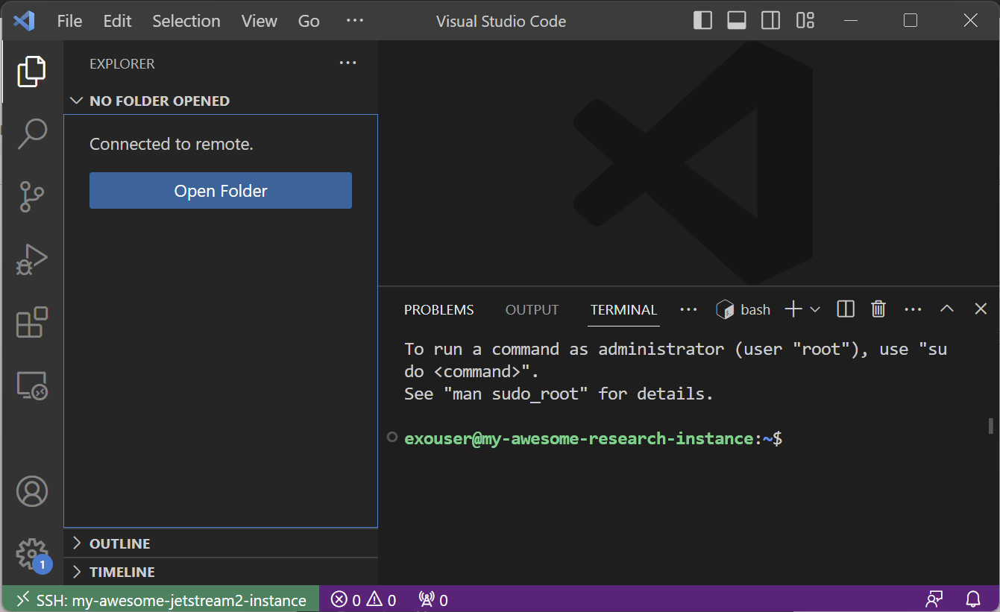


{: .warning }
**Note:** You may get a pop-up box asking to choose whether you're using Linux, Windows, or Mac. **Select Linux**, since we are connecting to JetStream2 which uses the Linux operating system.


## Creating First Project

### Creating our starter files

Now that you are connected to a server, we can set up the development container!

1. In your terminal, run the following code where you should replace `<project-name>` with the name of your project/directory you wish to create:

```
copier copy gh:UCSB-PSTAT/devcontainer-template <project-name>
```

2. Answer the questions by selecting from the options provided. We will be using R in this workshop.

```
🎤 What is the name of your project? (Must be unique and use lowercase, dashes -, underscores _ ONLY) my-awesome-project 🎤 What language(s) will you use in this project? R 🎤 Do you want to install Visual Studio Code extensions for Jupyter notebooks using R? Yes 🎤 Install RStudio Server? This is optional if using VS Code and R extensions for development. Yes 🎤 Install Quarto? Quarto is optional publishing system compatible with R. Yes 🎤 Do you want to include example files? Yes Copying from template version 1.4.1 create . create .devcontainer create .devcontainer/Dockerfile create .devcontainer/devcontainer.json create README.md create example.Rmd create .copier-answers.yml
```

3. Run the command below to view your new project folder (again, replace `<project-name>` with the name of your project/directory you created):

```
tree -a <project-name>
```

```
<project-name> ├── .copier-answers.yml ├── .devcontainer │ ├── devcontainer.json │ └── Dockerfile ├── example.Rmd ├── example-R.qmd └── README.md
```

{: .note }
You're project is ready to go! In the next section we will show how to start up the container to run our reproducible project!


## Starting Your Container

1. You now have a new directory in which you can open up a development container! To do so, click on "Open Folder" in the left menu and navigate to your project folder's name:

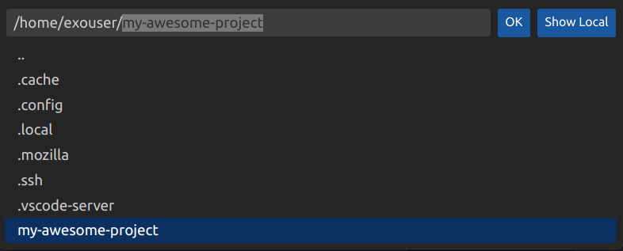


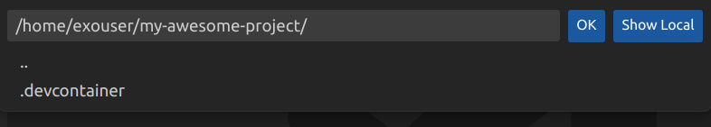


2. Click OK. This will open up your project's folder (in the example, it will open "my-awesome-project".


3. From here, you can click to "Reopen in Container" or click on the bottom left green button and select "Reopen in Container":


4. Your container will be built. You can click on the bottom right hand dialogue to view the build process log file.

{: .warning }
**Note:** The first time build process can take *20-30 minutes* to complete! Please be patient! After the first build, starting up a container will take less than 10 seconds.For now, click on the notification button on the bottom right and click on "(show log)": 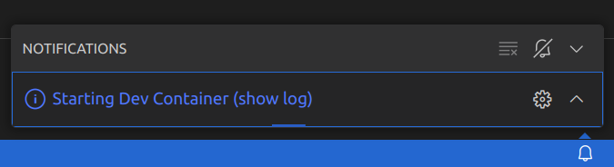


## Small Interlude...

So while the container builds, let's take a step back and break this down...


### Overview of what we have...

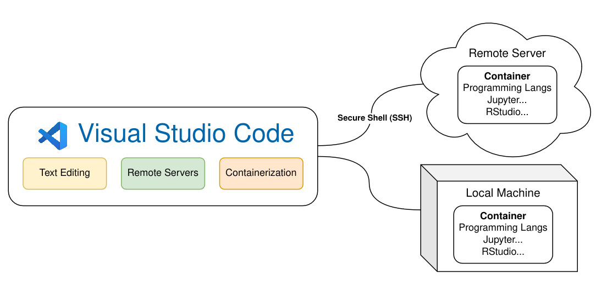


In essence, we use the VS Code text editor for the following 3 things:

1. Text/Code editing
2. Connecting to remote servers in the cloud
3. Connecting to containers whether on a remote server or on your local machine

Today, we are working inside a remote Jetstream2 instance and you can currently watch your container being built on there. Containers help isolate any required system packages, programming language packages, and tools that your project requires from the rest of your system. This means that if your project has specific versioning requirements, these can be baked into your container via the container configuration files. But what are those files? They are...

- Dockerfile - the main configuration file that contains all your system, programming language, and tool setup written as code.
- devcontainer.json - a file that integrates the container building and running process with VS Code and is part of the "[Development Container](https://containers.dev/)" standard.

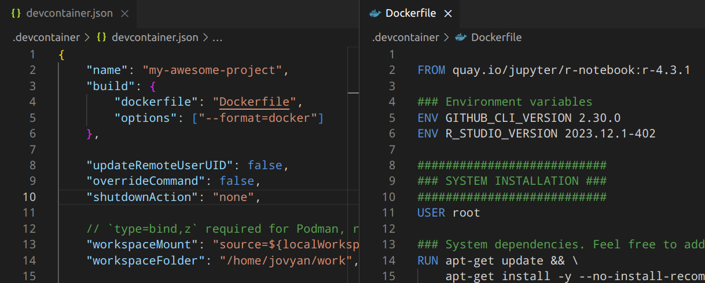


On their own, containers are usually managed via terminal using terminal commands of the containerization software in question. However, with the Dev Containers standard, we can easily delegate running and connecting to containers to the VS Code UI. We will discuss how to make adjustments to these files in a little bit.

We can take a look at the 2 files and note that they can be non-trivial to put together. This is why we created the devcontainer template that we used today to generate the project files. This creates an easily extendable configuration with well documented container files that can be modified to your liking as the complexity of your project develops which we will talk about next.

By now, your VS Code instances should look a little something like this:


Click on the "+" icon next to the "Dev Containers" dialogue to open up a new terminal instance which will have a "Jupyter Token" pop-up once launched:

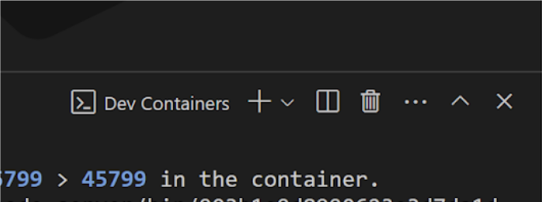


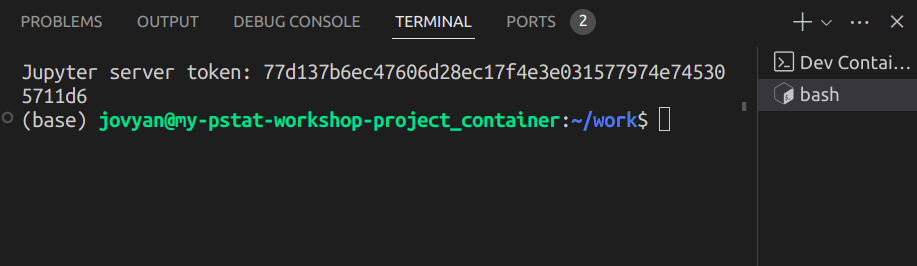


{: .note }
Your container is now ready to use on Jetstream2! Note that the bottom left hand corner now says that you are working in a Dev Container.


## Accessing JupyterLab and RStudio

We can do most of our editing in VS Code with extensions for Python, R, and other languages; however, our container comes with additional tool options that can be more conducive for data analysis such as JupyterLab and RStudio. Here, we will show how to access these container tools.

1. Open up a new VS Code Terminal by pressing the + button as seen below:

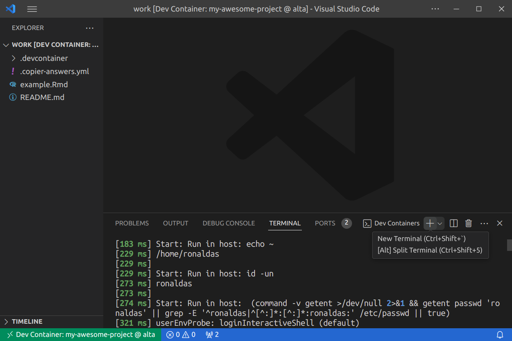


2. You will see the following pop up showing a Jupyter server token. Double click it and right-click to "Copy" the token:

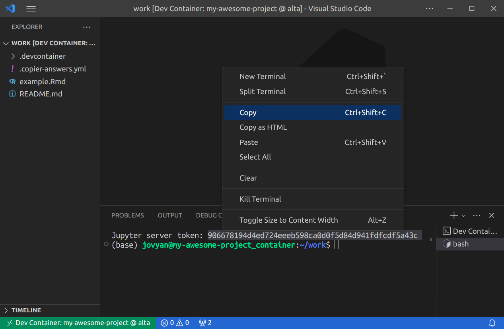


3. Head into "Ports". Look for port 8888 (which will be labeled as "Jupyterlab"). Mouse over the "Forwarded Address" box and click on "Open in Browser":

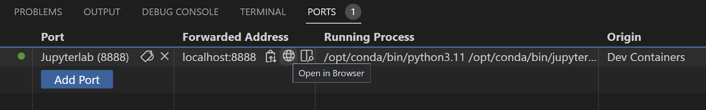


4. You will be taken to the following login page. Here you can input your copied Jupyter token. You will only need to do this once, next time it will not ask you for the token!

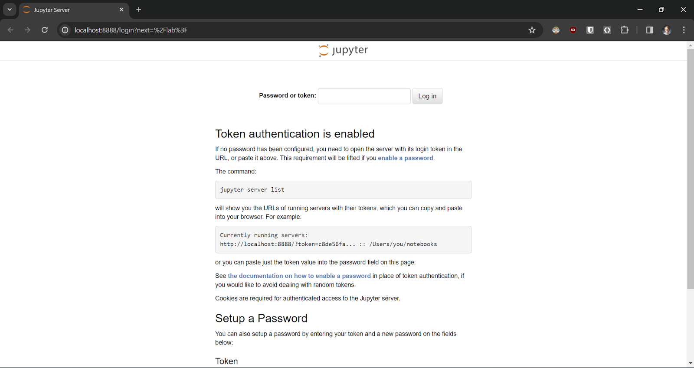


5. From here, you will be taken to the JupyterLab landing page. You will see a number of options for coding but what we will be using is RStudio Server. You can click on the button to start up the server in a separate window which will have the familiar RStudio interface but inside your browser being run on your Jetstream2 instance!

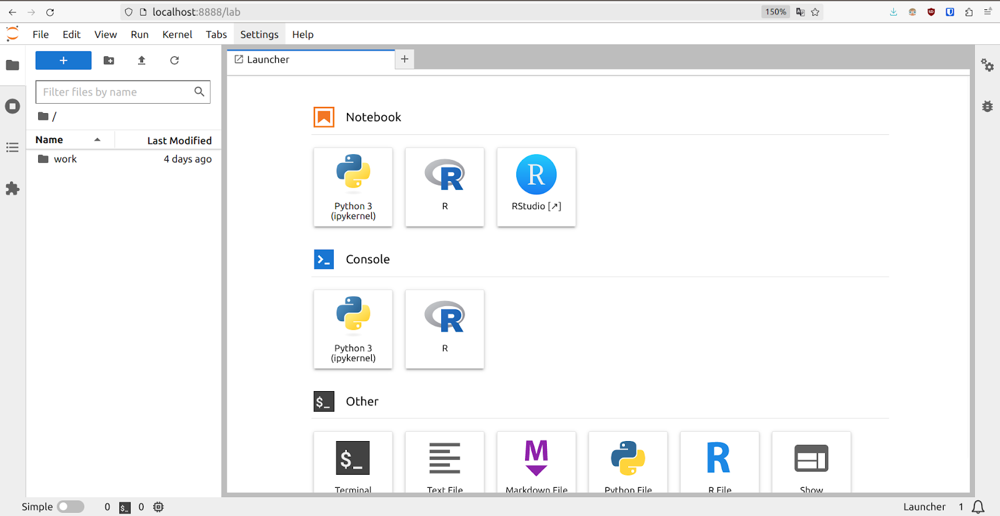 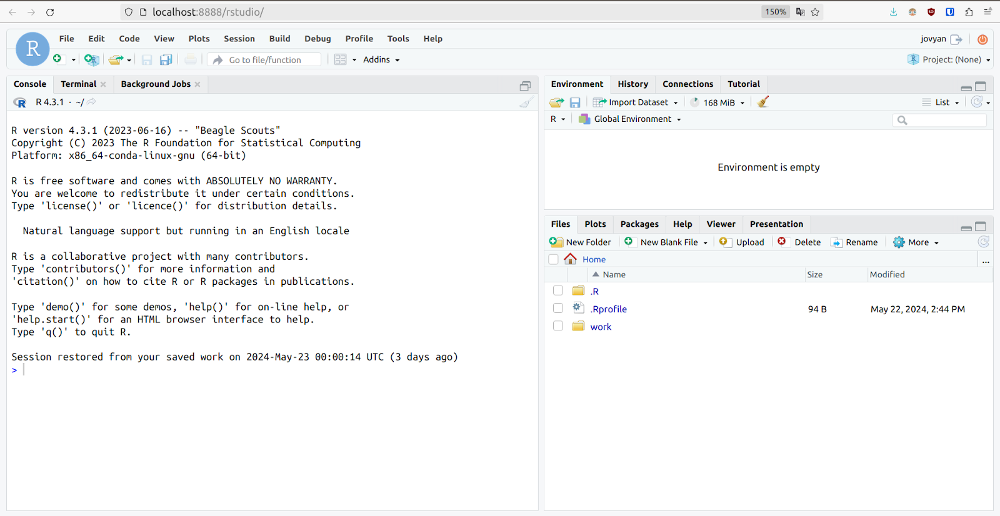


## Reproducible Project – Packaging

To show off the usage of development containers for reproducibility, we will do a small sentiment analysis on the famous "To be or not to be" speech from William Shakespeare's Hamlet. Containers give us a lot of flexibility on the type of packages and tools we can install using commands we are familiar with (`pip install ..., mamba install ..., install.packages(...)`). However, to create a reproducible project that can be shared and easily setup and built we need to make changes to our actual Dockerfile, the file that defines the entire computational environment.

1. Let's open up the `example.Rmd` file which has some starter code and functions for us to use. We can do this by selecting "Files" in the bottom right pane and selecting `example.Rmd`.

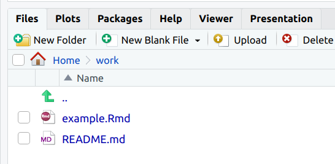


2. Inside this file you will notice a cell called `{r setup ...}`. Let's add a few packages underneath the knitr options:

```
```{r setup, include=FALSE} library(ggplot2) library(syuzhet) knitr::opts_chunks$set(echo = TRUE) ```
```

3. Once we run this chunk, you'll notice that we have `ggplot2` but not `syuzhet`. We will need to add this package to our container files so that in the future, when this project is shared with others, it can be built and run without additional tweaking. More than that, we will do so in a manner that specifies the exact package version we wish to install. This is because by default, R will install the latest version of packages. There are times when doing so can break an installation due to either specific version requirements, dependency issues, or upstream changes in other packages.

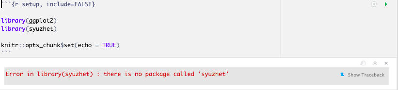


4. First, let's track down the specific package in CRAN: [https://cran.r-project.org/](https://cran.r-project.org/)
5. Under "Software" click on "Packages":

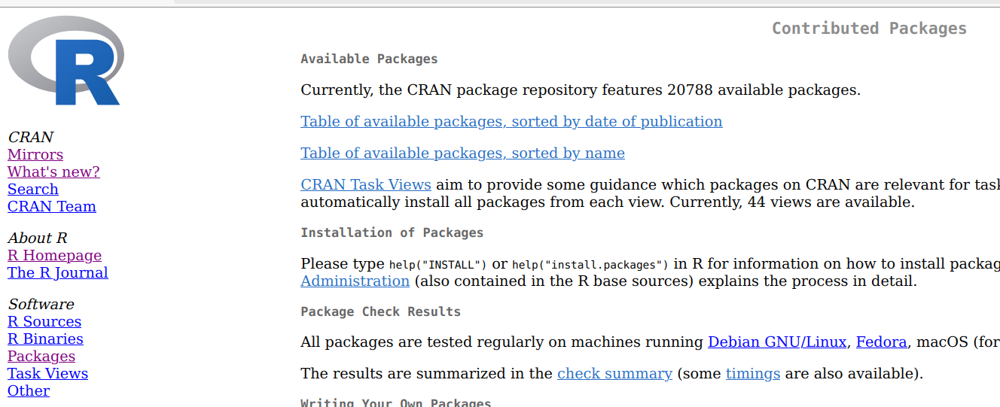


6. Click on "Table of available packages, sorted by name". In the following webpage, scroll or `ctrl` + `f` to find syuzhet. Click on the package name.

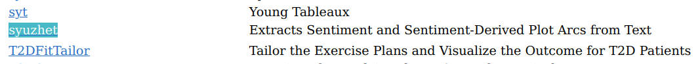


7. In the following webpage, take note of the latest available version. Depending on your project requirements, you may potentially need to use an older version than that, but for our project we just need to specify the latest stable version that is currently available.

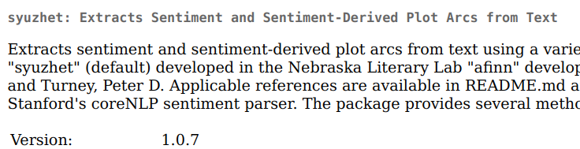


8. Next, we will include this package version as part of the installation process of the container inside our Dockerfile. The Dockerfile created from our template has annotations for where we can place additional packages to install. Scroll down your Dockerfile and insert an additional package underneath the comment with package instructions:

```
R -q -e 'remotes::install_version("syuzhet", version="1.0.7", repos="cloud.r-project.org")' && \
```

{: .note }
Let's break this down: R invokes an r-script to run -q quiets the R startup message -e specifies that an inline expression is going to be executed is a logical and used to chain installation statements together (bas) \ allows for statements to be chained together through separate lines

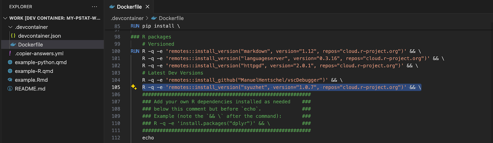


9. Save your Dockerfile (`ctrl` + `s`). You may have a pop-up saying that your configuration files have changed and that you need to rebuild your container. Either click on "Rebuild" in the dialog OR click the bottom left green remotes button and select "Rebuild Container":

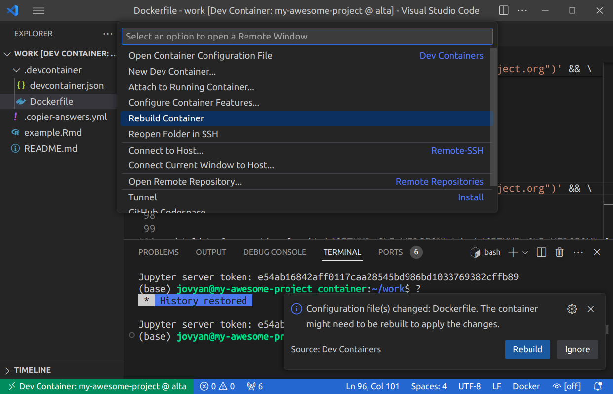


{: .note }
**Note:** Every time you modify your .devcontainer folder files, you will need to rebuild the container. Fortunately, these rebuilds will not take as long as the first one since VS Code caches certain build information.


## Reproducible Project – Finishing Up

Now that we have included the syuzhet package, we can finish up this little project! Below is the famous "To be or not to be" speech made by Hamlet. We will analyze and plot the sentiment of each line of this speech.

```
To be, or not to be, that is the question: Whether 'tis nobler in the mind to suffer The slings and arrows of outrageous fortune, Or to take Arms against a Sea of troubles, And by opposing end them: to die, to sleep No more; and by a sleep, to say we end The heart-ache, and the thousand natural shocks That Flesh is heir to? 'Tis a consummation Devoutly to be wished. To die, to sleep, To sleep, perchance to Dream; aye, there's the rub, For in that sleep of death, what dreams may come, When we have shuffled off this mortal coil, Must give us pause. There's the respect That makes Calamity of so long life: For who would bear the Whips and Scorns of time, The Oppressor's wrong, the proud man's Contumely, The pangs of despised Love, the Law's delay, The insolence of Office, and the spurns That patient merit of th'unworthy takes, When he himself might his Quietus make With a bare Bodkin? Who would Fardels bear, To grunt and sweat under a weary life, But that the dread of something after death, The undiscovered country, from whose bourn No traveller returns, puzzles the will, And makes us rather bear those ills we have, Than fly to others that we know not of? Thus conscience does make cowards of us all, And thus the native hue of Resolution Is sicklied o'er, with the pale cast of Thought, And enterprises of great pitch and moment, With this regard their Currents turn awry, And lose the name of Action. Soft you now, The fair Ophelia? Nymph, in thy Orisons Be all my sins remember'd.
```

1. First, let's make a new cell in R

```
```{r text_processing}

```
```

2. Inside the cell, copy/paste Hamlet's speech as a string:

```
hamlet <- ("To be, or not to be, ...
...
Be all my sins remember'd.")
```

3. Now let's perform a string split along each newline character (`\n`). We also need to "unlist" the output since it gets processed as a list of lists:

```
hamlet_processed <- strsplit(hamlet, "\n", perl=TRUE)
hamlet_processed <- unlist(hamlet_processed)
hamlet_processed
```

4. We can now calculate the sentiment values on each sentence in the character vector using the `get_sentiment` function from syuzhet:

```
sentiment <- get_sentiment(hamlet_processed)
```

5. We will now convert the calculated sentiment values and create a dataframe out of them for plotting:

```
df <- data.frame(lineno=1:length(sentiment), sentiment=sentiment)
```

6. Finally, we create a nicely formatted plot using ggplot which will produce a plot!:

```
ggplot(df) +
geom_line(aes(x=lineno, y=sentiment)) +
labs(x="Line Number", y="Syuzhet Sentiment")
```

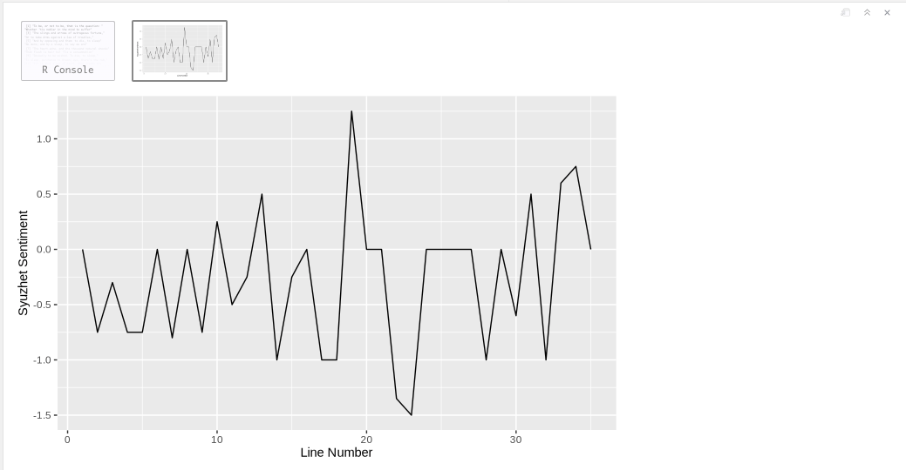


{: .note }
This completes our little illustrative project! We can now build this R markdown file into a PDF that is saved as part of our project to further distribute elsewhere!


## Remote computing


Let's talk a bit about the remote computing we were using today and how you could get access to it. Compute time on these instances is made available through the National Science Foundation's [Advanced Cyberinfrastructure Coordination Ecosystem: Services Support](https://access-ci.org/) (NSF ACCESS) program which exists "...to help researchers and educators, with or without supporting grants, to utilize the nation's advanced computing systems and services – at no cost."

While NSF ACCESS provides time in the form of credits, the actual compute instances we are using are through Indiana University's Jetstream2 supercomputing system. Jetstream2 aims to make research computing easy by providing access to instances, remote desktop, and resource management all through the browser. NSF ACCESS is not limited to Jetstream2 as there is a variety of [resource providers](https://allocations.access-ci.org/resources) available to choose from. That said, if you want direct support, UCSB PSTAT provides support for Jetstream2 development container images that we used today!

To get started, visit [the ACCESS website](https://access-ci.org/about/get-started/) and then:

1. Sign-up for an ACCESS account.
2. Complete required submission paperwork (more on that below).
3. Once approved, head over to [the Jetstream2 website](https://jetstream-cloud.org/) and submit your approved allocation there.
4. From there, you will be able to login and access your Jetstream2 allocation as well as add additional people under your allocation for usage (especially useful for labs/groups with larger units)

The number of units that you can apply to can be summarized as follows:

For limited scale projects (dissertations, papers, general grad student work)

- Submission of abstract + sign-off from advisor required
- EXPLORE (400,000 credits)

For larger scale projects (research labs, classroom work, heavy compute)

- Submission of 1-3 page project proposal
- DISCOVER (1.5 million credits), ACCELERATE (3 million credits)
- MAXIMIZE (unlimited, 10 page proposal, application open twice a year)

Regardless of initial application, you can always apply for higher tier later!

Below is a table of various Jetstream2 instance sizes and how long they can be run continuously, without shutting down with 400K credits that graduate students can apply for. Today we were using the **Large CPU** system:

| **System Type** | **Resources** | **Days of continuous compute (@ 400K credits)** |
|---|---|---|
| L CPU | 16 CPUs, 60 GB RAM | 1040 days (16 credits/hour) |
| XL CPU | 32 CPUs, 125 GB RAM | 520 days (32 credits/hour) |
| XL GPU | 32 CPUs, 125 GB RAM, 40 GB GPU | 130 days (128 credits/hour) |
| XL RAM | 128 CPUs, 1000 GB RAM | 65 days (256 credits/hour) |

For a more thorough breakdown of the available instances and information on credits, check out the [Jetstream2 documentation](https://docs.jetstream-cloud.org/general/vmsizes/#instance-flavors).


## Distributing Research


As the final part of the workshop, we want to draw your attention to some helpful resources for maintaining and publishing your research code. In the digital age, distributing research effectively and efficiently is paramount for ensuring reproducibility, collaboration, and accessibility. This section will discuss how you can leverage GitHub and GitHub Codespaces for code management and execution, along with Zenodo for comprehensive research archiving.

### Using GitHub for Code Management

GitHub is a powerful platform for version control and collaboration, essential for managing research code. By storing your research code in a GitHub repository, you benefit from features such as issue tracking, pull requests, and continuous integration. These tools enable you to manage contributions from multiple collaborators seamlessly and ensure that changes are tracked meticulously.

### GitHub Codespaces

GitHub Codespaces takes collaboration a step further by providing a full development environment in the cloud. This allows researchers to work on their projects from anywhere, without the need to set up local development environments. The key to making this work efficiently is the use of `.devcontainer` configuration files. This eliminates the "it works on my machine" problem, significantly enhancing reproducibility.

Here is a [demo repository](https://github.com/UCSB-PSTAT/devcontainer-demo) with which we can launch a GitHub Codespaces instance if you have a GitHub account. Simply click on "Code" then "Codespaces" and lastly "Create codespace on main":

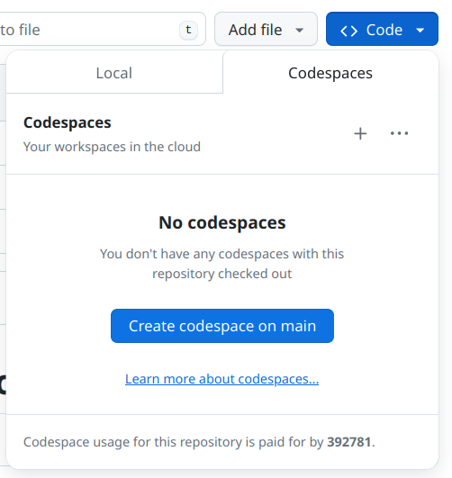


It should be noted that there are 2 caveats to this:

- To use GitHub Codespaces, you need a [GitHub Pro](https://docs.github.com/en/get-started/learning-about-github/githubs-plans#github-pro) account. Fortunately, GitHub offers GitHub Pro for free to educators, which makes this a cost-effective solution for academic research.
- `devcontainer.json` has to modified slightly to function correctly with Codespaces, namely we need to remove the following 3 bits of information:

```
"build": {
"dockerfile": "Dockerfile",
"options": ["--format=docker"] // remove for Codespaces (or Docker)
}
...
// change `type=bind,z` to `type=bind` for Codespaces (or Docker)
"workspaceMount": "source=${localWorkspaceFolder},target=/home/jovyan/work,type=bind,z",
...
"runArgs": [
...
"--userns=keep-id:uid=1000,gid=100", // remove for Codespaces (or Docker)
...
]
```

### Archiving with Zenodo

While GitHub is excellent for code management, it is equally important to have a robust system for archiving the entirety of your research output. This is where [Zenodo](https://zenodo.org/) comes into play. Zenodo is a research repository managed by CERN that provides a secure and reliable platform for storing a variety of research outputs.

- **Research Papers**: You can upload preprints or published versions of your research papers, ensuring they are freely accessible and citable.
- **Research Code**: Zenodo integrates seamlessly with GitHub allowing you to archive your code alongside your paper.
- **Research Data**: Zenodo supports the storage of research data, including confidential data that has been anonymized. This ensures that your datasets are preserved and accessible for future studies.

Lastly, by using Zenodo, you can generate DOI links for your research outputs, which enhances their visibility and citability. This is particularly important for ensuring that your work is easily discoverable and can be referenced by other researchers in the field.

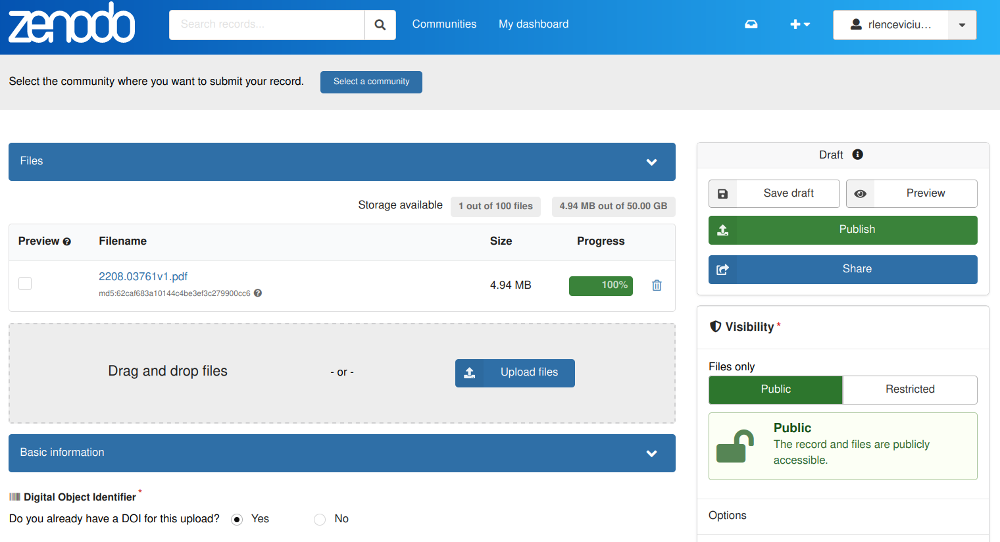


### Combining GitHub and Zenodo

The combination of GitHub and Zenodo provides a powerful ecosystem for distributing research:

1. **Version Control and Collaboration**: Use GitHub to manage and collaborate on your research code.
2. **Reproducible Development Environments**: Utilize GitHub Codespaces with .devcontainers to ensure consistent development environments across all contributors.
3. **Archiving and Citability**: Link your GitHub repositories to Zenodo to archive your code and generate DOI links for all your research outputs, ensuring they are preserved and citable.

This integrated approach not only enhances the reproducibility of your research but also ensures that your work is accessible and can be built upon by the wider research community. By leveraging these tools, you contribute to a more open and collaborative research environment, ultimately advancing scientific discovery.


**Next up:** continue on to [the related wiki page](https://ucsbcarpentry.github.io/workshop/2024/06/04/ucsb-containers.html).