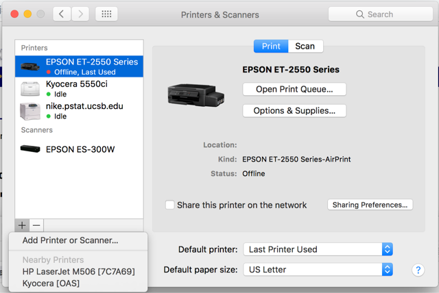
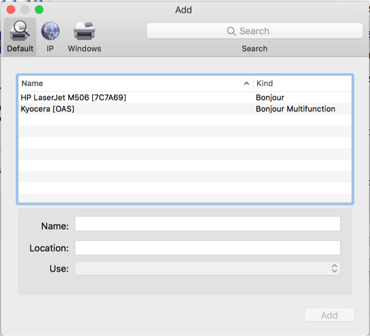
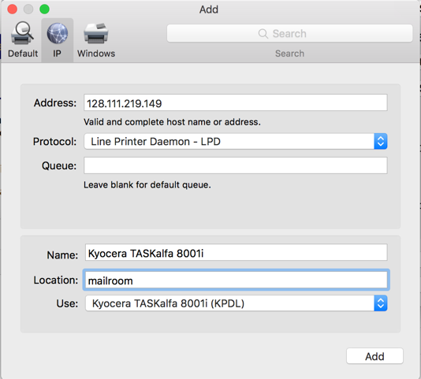
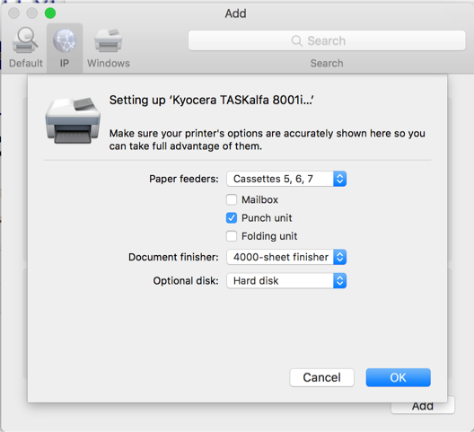
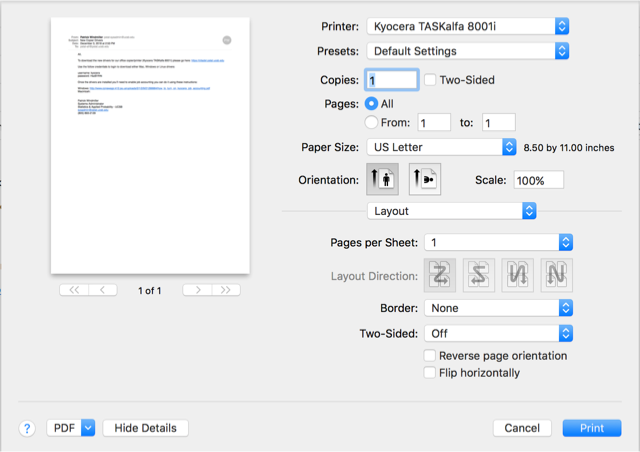
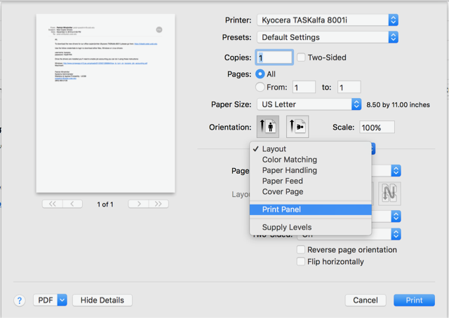

Use this guide to install the Kyocera printer drivers on a MacOS machine.

## Introduction

This tutorial will help you install drivers for the mailroom printer on your personal MacOS machine.

### Prereqs

- Download of [Kyocera TASKalfa 8001i MacOS driver](https://ucsb.box.com/s/48d6q5jk6jofygxmwoj24b32v1v62x60)

### Useful Links

[Google Docs Version of Tutorial](https://docs.google.com/document/d/1qt16tP26RZPOllHIvHCzWWv1KS7-M4Cs4tmr6eU16eU)

## Installation

1. Go to ‘Apple' menu => ‘System Preferences' => ‘Printer Scanners'. Click the ‘+' symbol to add a printer.

2. Click the ‘IP' icon-next to ‘Default':

3. In the address field put, ‘128.111.219.149' then for the protocol select, ‘Line Printer Daemon - LPD'. Fill out the Name, Location field as below. Make sure that the correct driver is already selected (it should auto select when you tab out of the Address field. If not, select it from your Downloads folder.).

## Configuration

4. Make sure that all of the below settings are selected then click, ‘OK'

5. Open up a print dialog box by going to print a document.

6. Click on ‘Layout' drop down and select ‘Print Panel'.

{: .warning }
**CRITICAL:**If you don't see "Print Panel" as an option then you'll need to re-do these steps from a non-Apple or Adobe program. This was done via Microsoft Word.

7. Click on the Two-Sided checkbox if you want Two-Sided printing by default.
8. 
9. Now to save the setting you'll need to click on ‘Default Settings' next to ‘Presets:' and select, ‘Save current settings as Default' => give it a name of something like, "Kyocera in mailroom".

**Next up:** continue on to [the related wiki page](/docs/department#drivers).