Use this guide to install the Kyocera printer drivers on a Windows machine.

## Introduction

This tutorial will help you install drivers for the mailroom printer on your personal Windows machine.

### Prereqs

- Download of [Kyocera TASKalfa 8001i Windows driver](https://ucsb.box.com/s/opjn0xehgpadi4zh86zr20dh868dqnbf)

### Useful Links

[Google Docs Version of Tutorial](https://docs.google.com/document/d/16wWtuBrVarh3kZDWFhoQt3M_pVxf5t6GhvIci9KRyqI)

## Download

1. [Download the driver](https://ucsb.box.com/s/opjn0xehgpadi4zh86zr20dh868dqnbf), uncompress it, and enter the folder within:

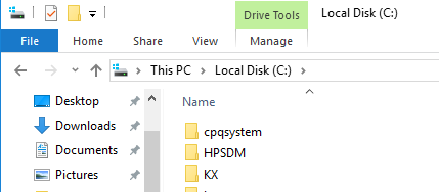

2. Open up the "KX" folder and look for the "en" folder. Open it:

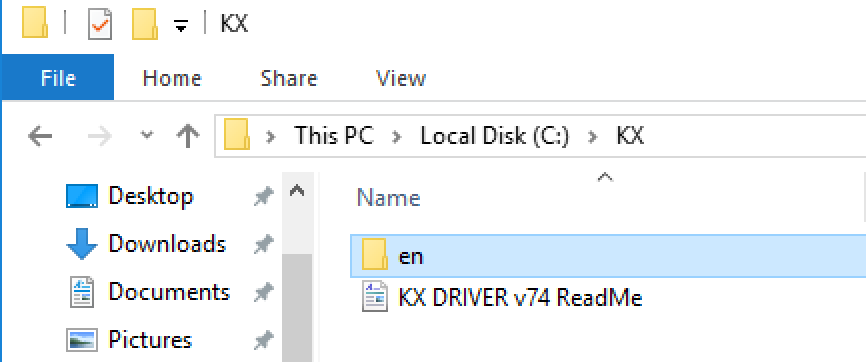

## Installation

3. In the "en" folder look for and open "KmInstall":

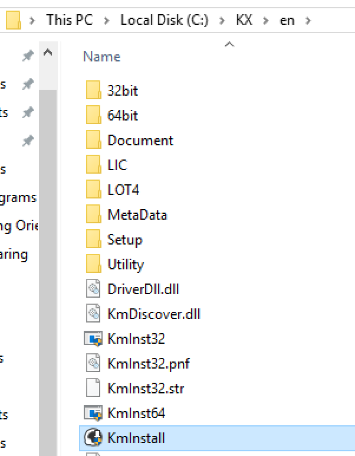

4. Click 'Yes' to start the installer

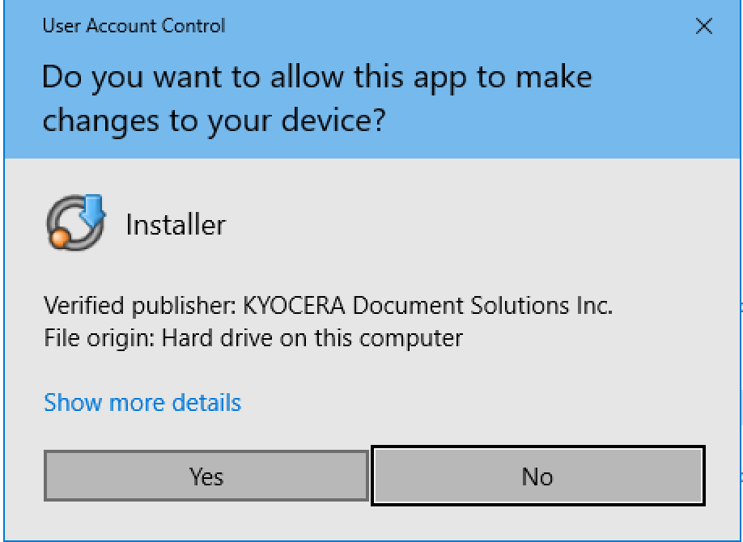

5. Click Accept

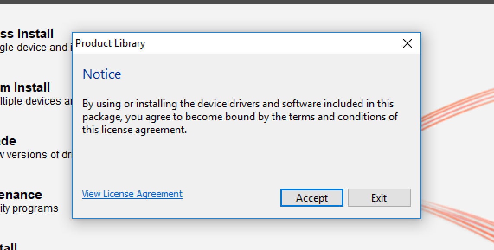

6. Click "OK"

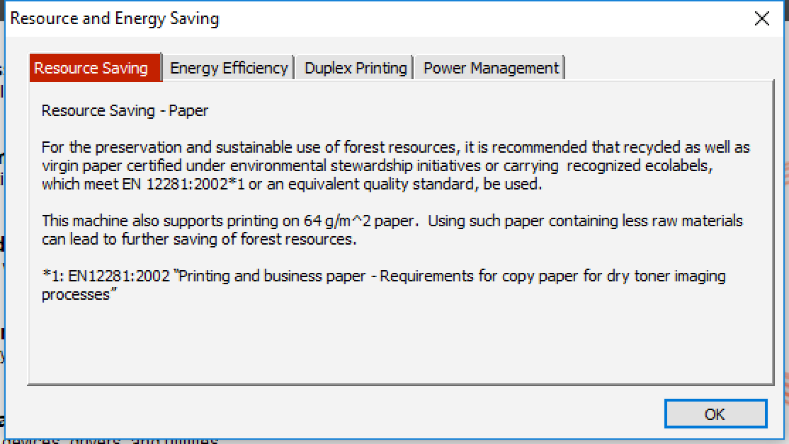

7. Click Custom Install

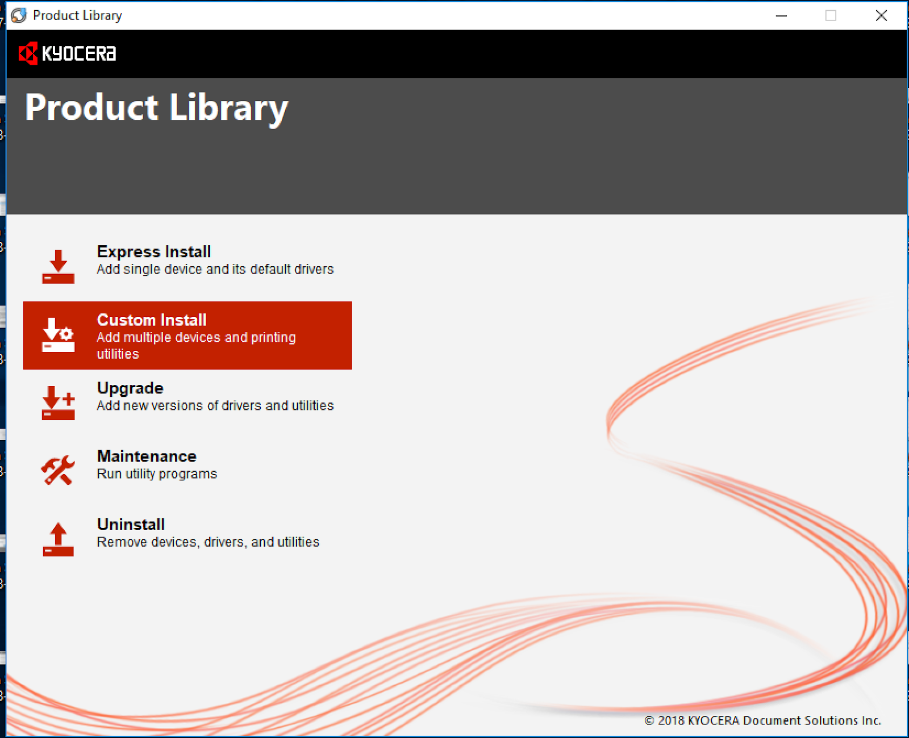

## Configuration

8. Now you may or may not see the TASKalfa 80001i in the list like it is below. If you don't see it then you will need to click on the '+' sign next to the words, "Add custom device"

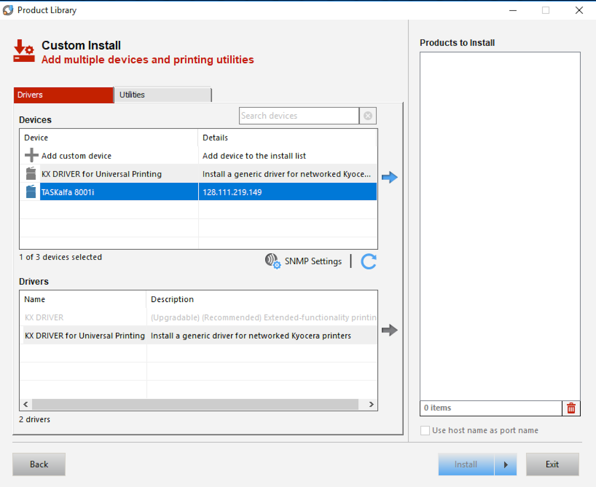

9. If you do have to click the '+' sign then you will be taken to the image below. On your system click on the above highlighted port name then click on "OK" to continue.

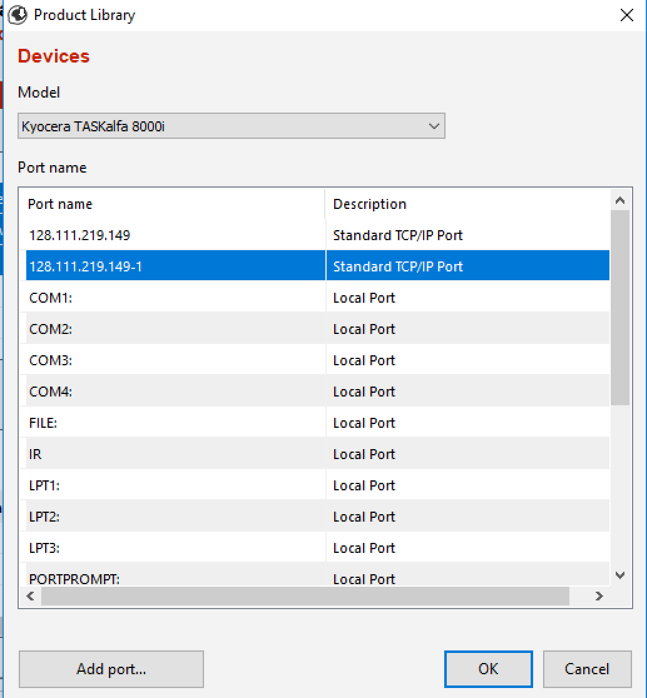

10. Now make sure that TASKalfa 8001i is highlighted and click on the blue arrow to its right.

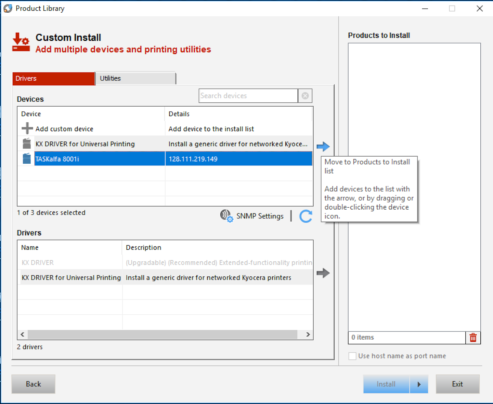

11. Clicking on the blue arrow will move the install package over to the "Products to Install List":

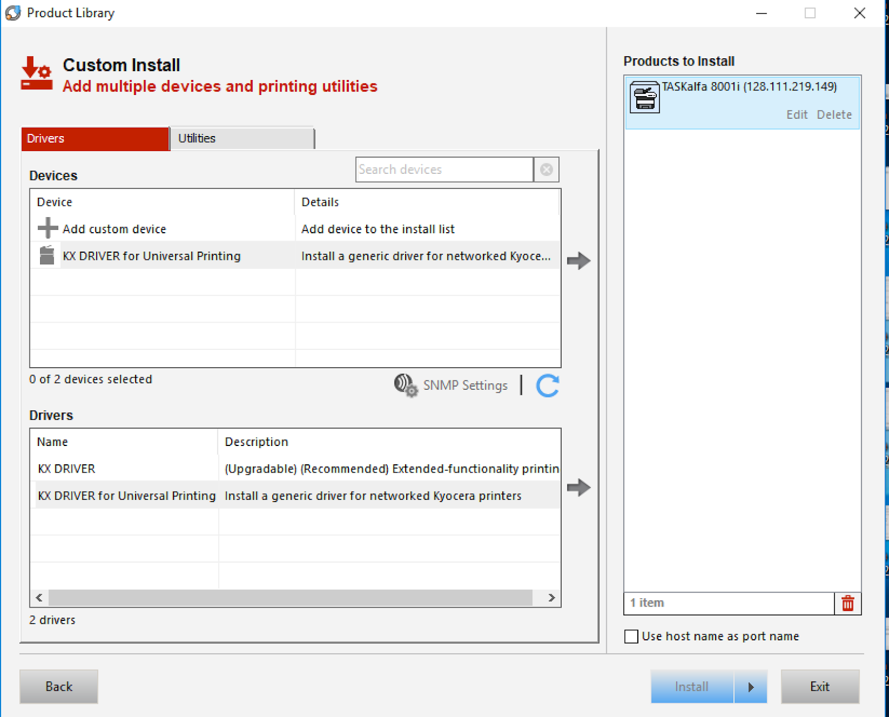

12. Now under drivers, click on the "KX Driver" **NOT** the "KX Driver for Universal Printing"

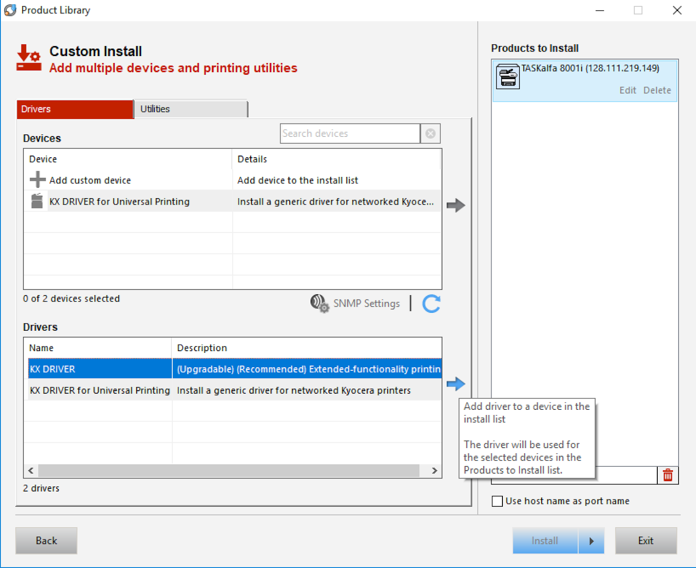

13. Then click on the blue arrow to move the selected driver into the, "Products to Install"

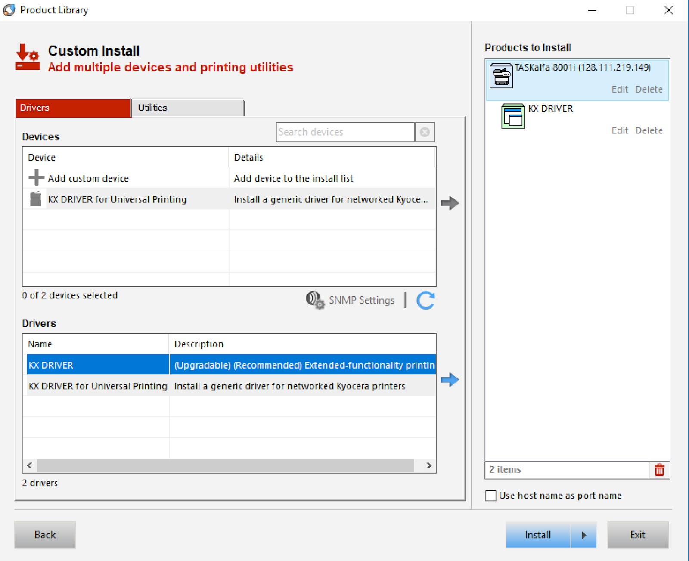

**Next up:** continue on to [the related wiki page](/docs/department#drivers).