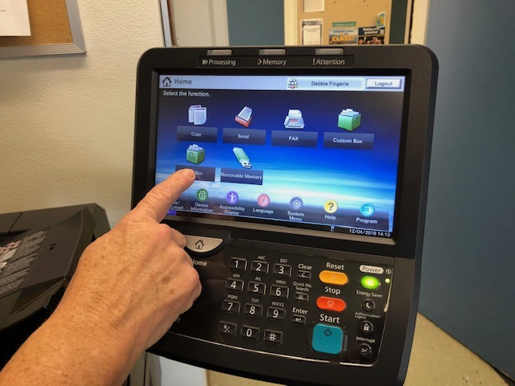
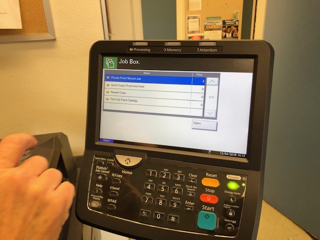
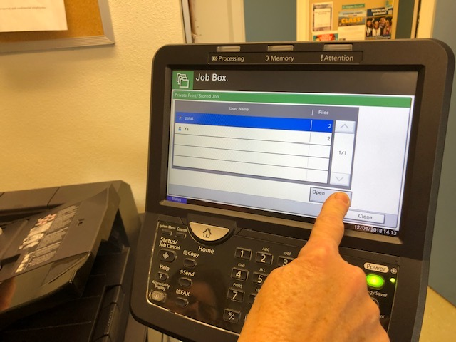
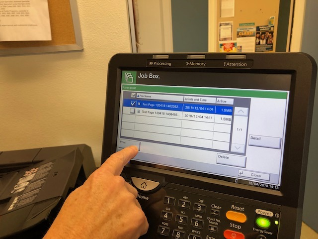
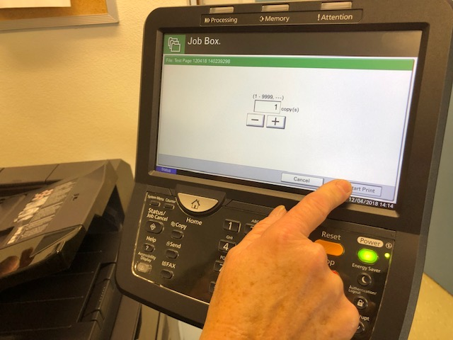

## Introduction

This tutorial will help you work the printer in the mailroom.

### Optional

- Completion of [Kyocera driver](/docs/department.html#printing) installation

### Useful Links

[Google Docs Version of Tutorial](https://docs.google.com/document/d/1WnD7ZmUyZoqdxFuk47FHCdjoTVAfQJxDqoCi-qBqxOQ)

## Instructions

1. Press the "Job Box" button in the lower left as seen below:

2. If not already highlighted in blue click on the, "Private Print/Stored Job" row to highlight it in blue. Then press the "Open" button:

3. In the next screen you will see a list of users that have submitted jobs. Press on your name and press open.

4. The job list will show all available jobs you can print (once a job is released it is deleted from the system immediately). Press on all of the jobs you want to print. You will see them get a check mark. Finally press the 'Print' button.

5. Now you must select how many copies you want, then press 'Start Print' button.

**Next up:** continue on to [the related wiki page](/docs/department#printing).