## Introduction

This tutorial will show how to connect to a remote server such as Alta using VS Code, setup the development container environment, and use what it has to offer!

**If you run into any issues during this tutorial, please ask for help in the**[**PSTAT Research Computing Users**](https://chat.google.com/room/AAAAR6wMcN0?cls=7)**Google Group!**

### Prereqs

- [VS Code](https://code.visualstudio.com/) text editor
- [Dev Containers](https://marketplace.visualstudio.com/items?itemName=ms-vscode-remote.remote-containers) and [Remote - SSH](https://marketplace.visualstudio.com/items?itemName=ms-vscode-remote.remote-ssh) Extensions. Install in VS Code by searching the extension shop using `ctrl`/⌘ + `shift` + `x` shortcut.
- PSTAT User Account

### Useful Links

[Google Docs Version of Tutorial](https://docs.google.com/document/d/1OZoi8dN7lrQDSSvWCPuMv8nvMI7W8OV3j02xwb5M7Fg)


## Connecting to a server

To run your code remotely you will first need to connect to a remote server such as Alta. For more information about available computing servers, checkout [this wiki entry](/docs/computing#remote-computing-sources).

With our VS Code extensions, remote connections are made simple:

1. Click on the **bottom right button** to "Open a Remote Window". This will launch the VS Code command palette for remote connections:

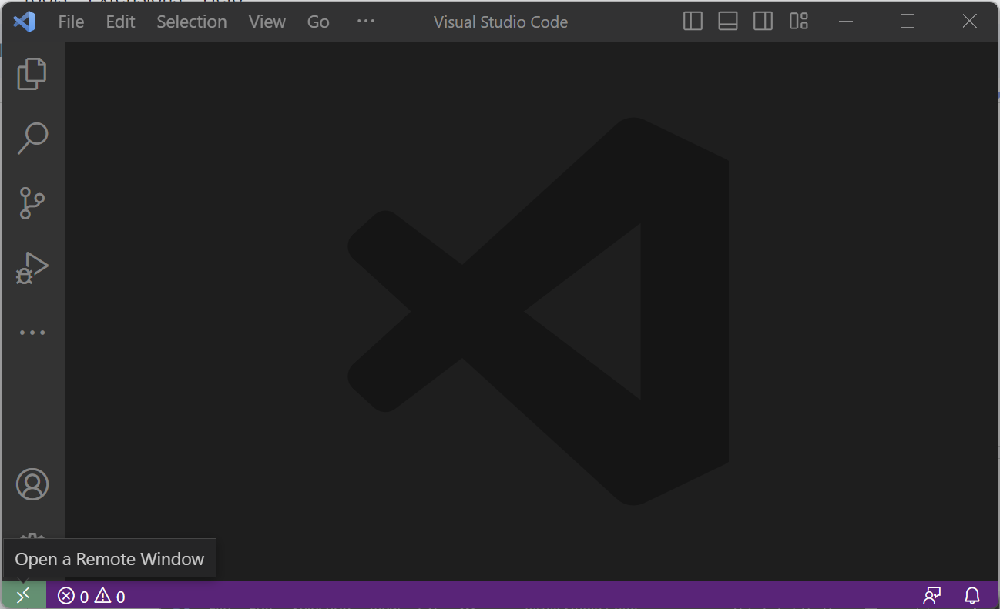


2. Select "Connect Current Window to Host..." option.


3. From here select the host you wish to connect to. If the remote host that you want to connect to does not appear in the options, use the "Add New SSH Host..." option. Type the following command where you replace `<NetID>` with your own NetID: with your own NetID:

```
ssh <NetID>@alta.pstat.ucsb.edu
```

{: .warning }
**Note:** This will connect you to Alta. If using another PSTAT server, replace `alta.pstat.ucsb.edu` with `<server-name>.pstat.ucsb.edu` where your `<server-name>` name is replaced with a server such as wavelet, denali, roble, etc.

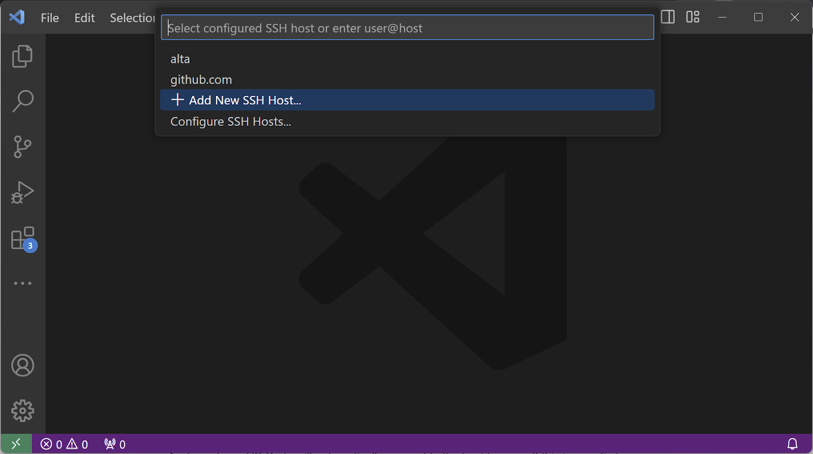


4. You will be prompted to save the configuration. Make sure to select either `C:\Users\<your_username>\.ssh\config` (Windows) or `~/.ssh/config` (MacOS/Linux). (MacOS/Linux).
5. From here, VS Code will automatically connect to the host for you. If this is your first time connecting to any remote server, it may take a few seconds for VS Code to install configurations in the background. *You may also be prompted about the type of operating system your server uses - select* *"Linux"*. Once the setup is complete you will be greeted with a similar window: . Once the setup is complete you will be greeted with a similar window:

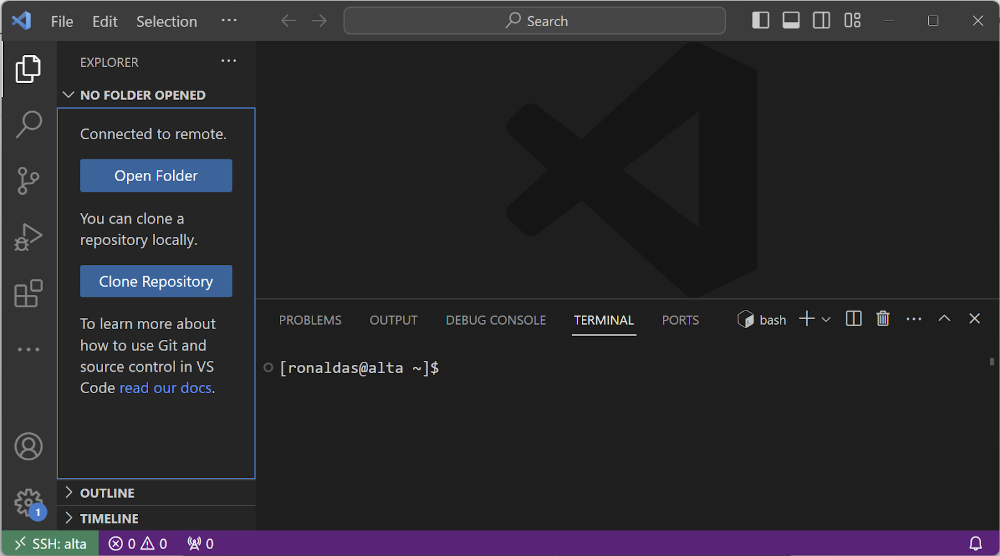


{: .note }
We are now connected to Alta! In the next steps we will generate your project directory with all the necessary files to develop in a container.


## Setup Development Containers

Now that you are connected to a server, we can set up the development container!

1. In your terminal, run the following code where you should replace `<project-name>` with the name of your project/directory you wish to create:

```
copier copy gh:UCSB-PSTAT/devcontainer-template <project-name>
```

{: .warning }
**Note:** Your project name should be **unique** i.e. if you have multiple projects you are working on, they should not share the same name. This can cause issues for the containers of each project.

2. Answer the questions by selecting from the options provided. An example can be seen below:

```
🎤 What is the name of your project? (Must be unique and use lowercase, dashes -, underscores _ ONLY) my-awesome-project 🎤 What language(s) will you use in this project? R 🎤 Do you want to install Visual Studio Code extensions for Jupyter notebooks using R? Yes 🎤 Install RStudio Server? This is optional if using VS Code and R extensions for development. Yes 🎤 Install Quarto? Quarto is optional publishing system compatible with R. Yes 🎤 Do you want to include example files? Yes Copying from template version 1.1.0 create . create .devcontainer create .devcontainer/Dockerfile create .devcontainer/devcontainer.json create README.md create example.Rmd create .copier-answers.yml
```

3. Run the command below to view your new project folder (again, replace `<project-name>` with the name of your project/directory you created):

```
tree -a <project-name>
```

```
<project-name> ├── .copier-answers.yml ├── .devcontainer │ ├── devcontainer.json │ └── Dockerfile ├── example.Rmd ├── example-R.qmd └── README.md
```

{: .note }
You're project is ready to go! In the next section we will show how to start up the container to run your code!


## Starting Your Container

1. You now have a new directory in which you can open up a development container! To do so, click on "Open Folder" in the left menu and navigate to your project folder's name:

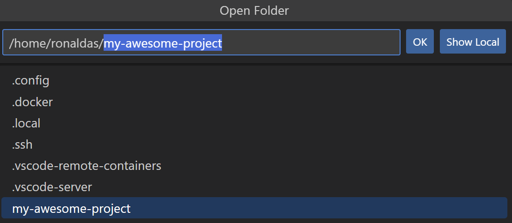


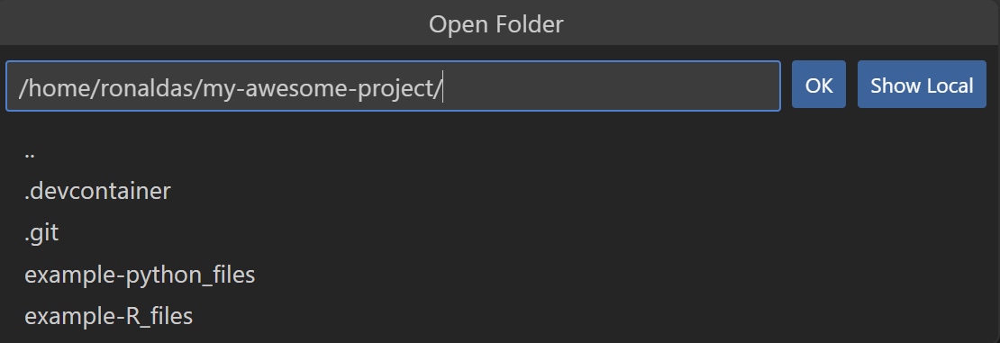


2. Click OK. This will open up your project's folder (in the example, it will open "my-research-project".

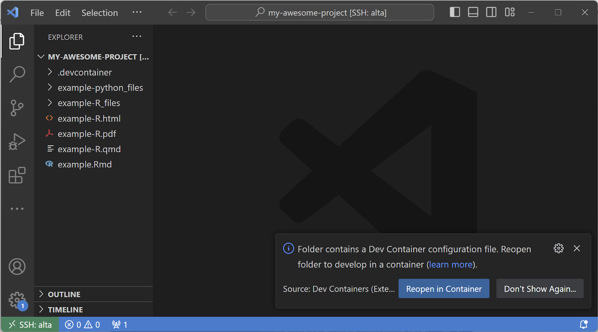


3. From here, you can click to "Reopen in Container" or click on the bottom left green button and select "Reopen in Container":

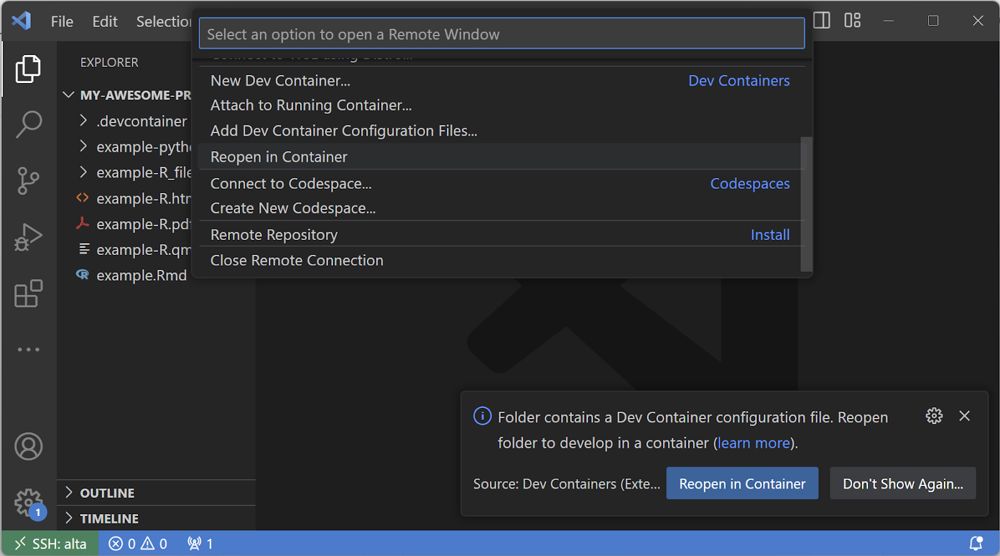


4. Your container will be built. You can click on the bottom right hand dialogue to view the build process log file.

{: .warning }
**Note:** The first time build process can take *20-30 minutes* to complete! Please be patient! After the first build, starting up a container will take less than 10 seconds.

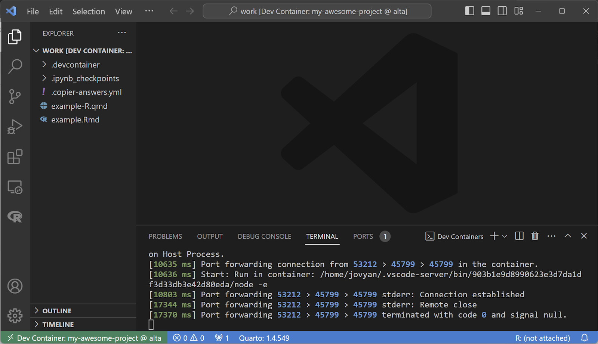


5. To leave the container you can click on the bottom left green button and click on the option "Reopen folder in SSH".

{: .note }
Your container is now ready to use on Alta! Note that the bottom left hand corner now says that you are working in a Dev Container. Feel free to jump in and begin working. Additional information on available tools and package installation can be found in the next steps.


## Accessing Jupyterhub + RStudio

Although you can edit files directly in VS Code, it may be more preferable to utilize more specialized tools such as RStudio to edit files such as Qmd/Rmd. This requires us to access Jupyterhub.

1. Open up a new terminal window either by pressing the "+" in the tool pane or by using ctrl/cmd + ` on your keyboard:

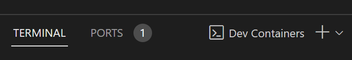


2. You will see the following terminal pop-up. Inside of it, there will be a "Jupyter server token". Copy it for the following step.

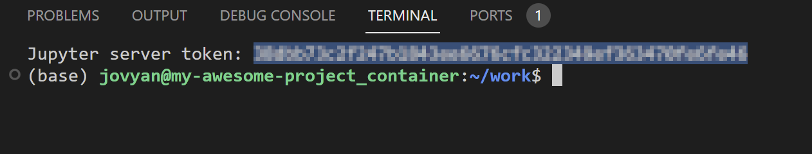


3. Head into "Ports". Look for port 8888 (which will be labeled as "Jupyterlab"). Mouse over the "Forwarded Address" box and click on "Open in Browser":


4. You will be taken to the following login page. Here you can input your copied Jupyter token or scroll down and set a password. Either way, every time you open the terminal you will always have access to the Jupyter token.


5. Upon logging in you will have access to Jupyterlab! From here, you can edit your files/notebooks using its interface or RStudio.

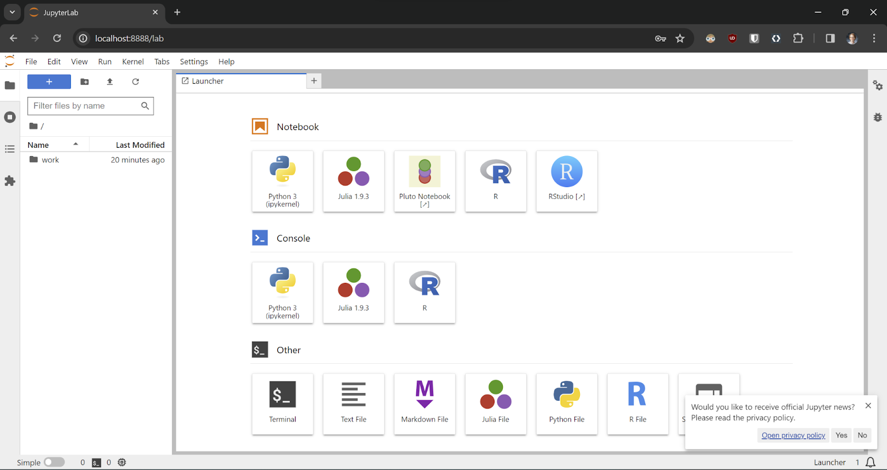


{: .warning }
**WARNING:** Make sure that you save all your files *inside* the work folder. If you save your project files anywhere else you **risk losing your work permanently**!: 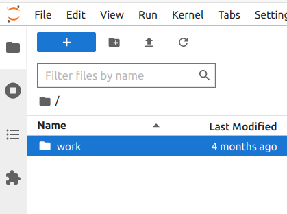 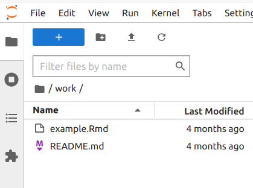

6. To open RStudio, simply select the RStudio button in the launcher.

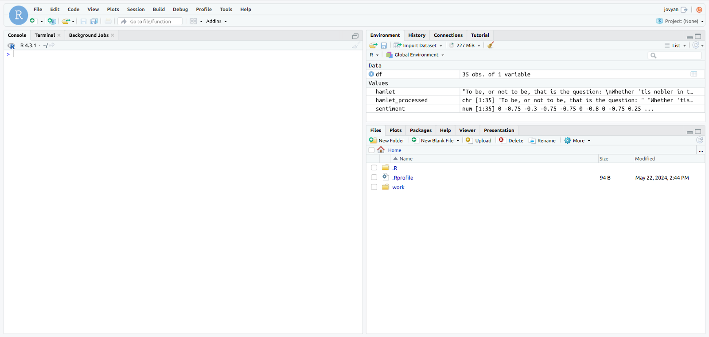


{: .warning }
**WARNING:** Make sure that you save all your files *inside* the work folder. If you save your project files anywhere else you **risk losing your work permanently**!: 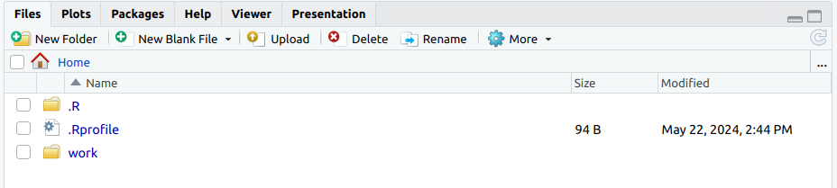 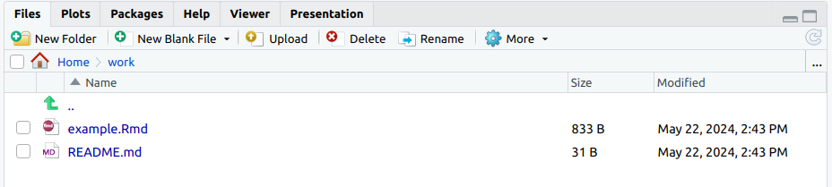


## GPU in Container

{: .warning }
**Note:** GPUs are only available on certain servers such as Tesla1, Roble, and SciFi. Additionally GPU access is only available when using *Python* as the primary language. R and R and Python are not supported.

To enable GPU access, use terminal command `nvidia-smi -L` outside of container to view available GPUs. From there, uncomment the `--device...` line in the `runArgs` section of `devcontainer.json`, set the device number(s), and rebuild the container.

```
"runArgs": [ ... // "--device=nvidia.com/gpu=device=" // uncomment and modify this line. ],
```


## Installing Packages

{: .warning }
**Note on reproducibility:** If you have questions about or wish to get help with including your R/Python language packages as part of your container configuration files (Dockerfile and devcontainer.json, please contact the Computing TA via the [**PSTAT Research Computing Users**](https://chat.google.com/room/AAAAR6wMcN0?cls=7) group.

### Python

#### Inside Container (immediate)

*This method will install packages immediately in your container but will*

*not*

*get added to your container configuration files for reproducibility by others.*

To install packages using the Anaconda distribution use the `mamba` command. This follows the same syntax as `conda` but runs a lot faster. To install packages using PyPI, it is sufficient to use `pip`.

```
$> mamba install numpy=1.26 ... $> pip install scikit-ntk==1.1.3
```

#### Inside Dockerfile (reproducible)

*This method will build your container with these packages pre-installed. If you share your configuration files with someone else, they will be able to reproduce your installation with no additional steps.*

*You will need to rebuild your container to install packages this way!*

To install Python packages in a reproducible way, you will need to add them to your Dockerfile. Simply add the package name underneath the comment for Anaconda/Pip packages followed by a ‘\'.

For example, here I am adding a Anaconda distribution package `scikit-learn` (using conda/mamba commands):

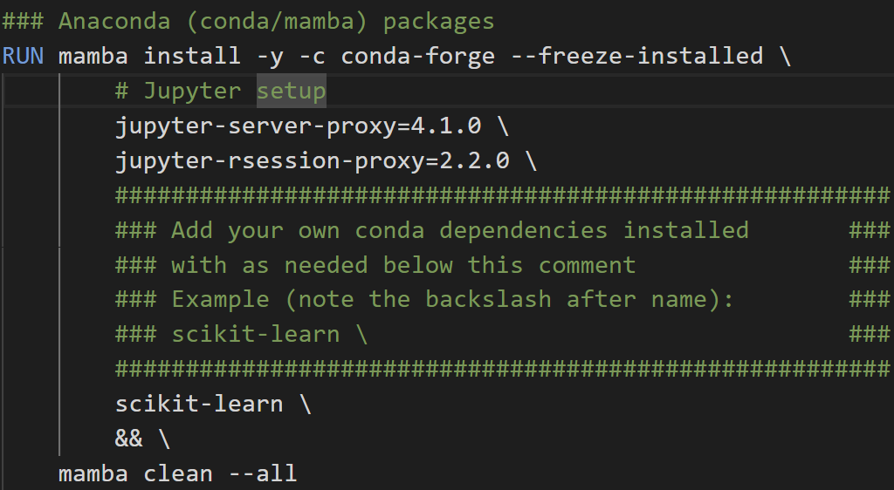


And here, I am adding a PyPI package `scikit-ntk` (using pip command):

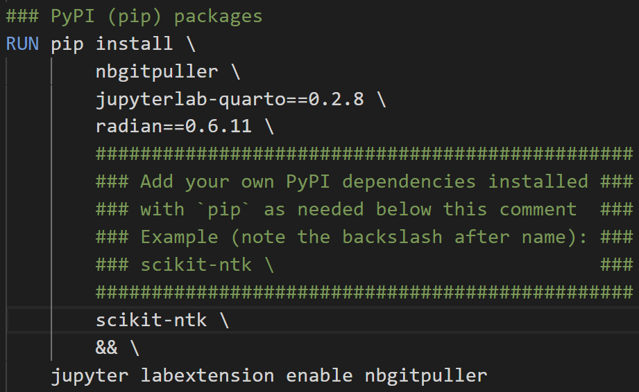


### R

#### Inside Container (immediate)

*This method will install packages immediately in your container but will*

*not*

*get added to your container configuration files for reproducibility by others.*

For R, any of your favorite commands for package installation should function out of the box (`install.packages(...)` being the most common). This can be run in 3 ways:

- Inside VS Code terminal *without* launching R:

```
$> R -e ‘install.packages("ggplot2")'
```

- Inside an attached R terminal either by typing "R" in VS Code terminal or attaching via interface:

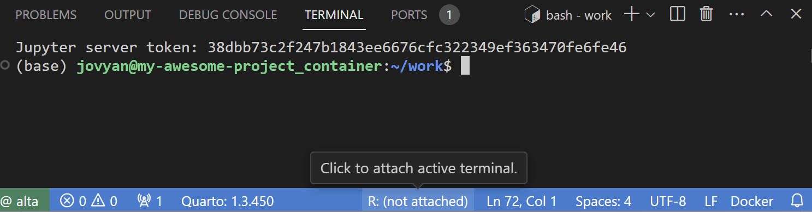


- Inside RStudio server

#### Inside Dockerfile (reproducible)

*This method will build your container with these packages pre-installed. If you share your configuration files with someone else, they will be able to reproduce your installation with no additional steps.*

*You will need to rebuild your container to install packages this way!*

To install R packages in a reproducible way, you will need to add them to your Dockerfile. You will need to add packages using this type of command underneath the comment for R packages:

```
RUN R -q -e ‘install.packages("ggplot2")'
```

For example, here I am adding the `syuzhet` package:

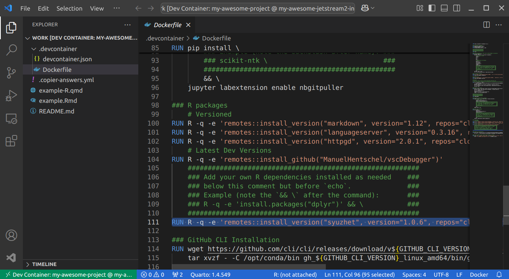


### System Packages

#### Inside Container (immediate)

*This method will install packages immediately in your container but will*

*not*

*get added to your container configuration files for reproducibility by others.*

To install system packages the `apt` command in combination with super user privileges (`sudo`):

```
$> sudo apt install package-name
```

#### Inside Dockerfile (reproducible)

*This method will build your container with these packages pre-installed. If you share your configuration files with someone else, they will be able to reproduce your installation with no additional steps.*

*You will need to rebuild your container to install packages this way!*

To install system packages in a reproducible way, you will need add them to the Dockerfile found in the .devcontainer directory of your project as shown below:

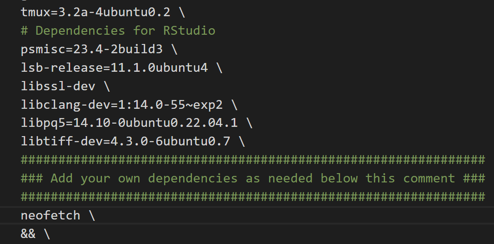


Here I am installing an additional package called "neofetch". **Make sure that each package is on its own separate line and ends with a backslash!**

{: .warning }
**Note:** Modifying container files will require you to rebuild the container! This can be done by using the keyboard shortcut ctrl/cmd + shift + p and typing "Rebuild Container": 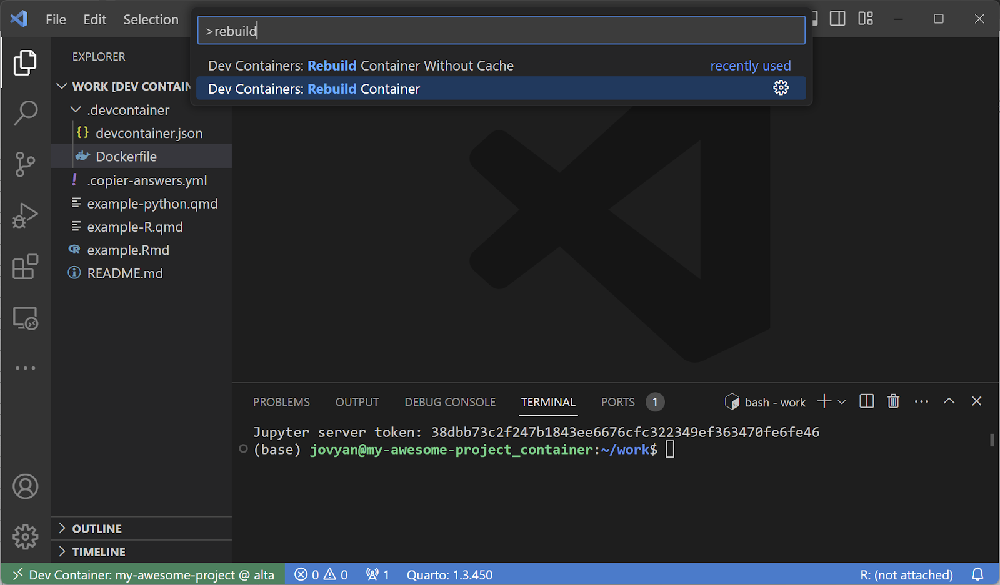


## Using GitHub

If you wish to clone/push/pull/create repositories, you will need to use [GitHub CLI](https://cli.github.com/manual/) to login while inside the container. This can be done using the `gh auth login` command. During the steps select:

- GitHub.com for your account
- HTTPS for your preferred protocol
- Yes to authenticating with your GitHub credentials
- Lastly, login with your web browser to complete authentication

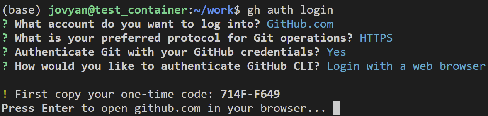


Once completed, you will now be able to manage GitHub repositories using HTTPS.

If you wish to create a repository on your GitHub account for your freshly minted project container use the following commands:

1. Convert generated files to a repository:

```
cd /home/jovyan/work/ git init git add * git commit -m "first commit" git branch -M main
```

2. Upload local repository to a new GitHub repository. **Be sure to choose, "Push an existing local repository to GitHub"**:

```
cd /home/jovyan/my-awesome-project gh repo create
```


## Next Steps

{: .note }
Congrats! You are now ready to work on your project within the Alta server on your own personal development container! *Make sure you're a part of the*[*PSTAT Research Computing Users*](https://chat.google.com/room/AAAAR6wMcN0?cls=7)*Google Spaces group to stay up-to-date with the latest beta testing information!*

To get more familiar with how your container works consider the following sets of tutorials:

- [Learn to manage your containers](/docs/devcontainer#management)
- [Learn more about custom setups](/docs/devcontainer#additional-features)


**Next up:** continue on to [the related wiki page](/docs/devcontainer#setup).