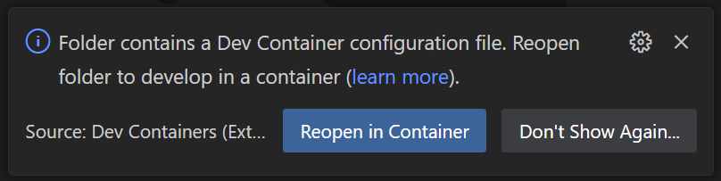
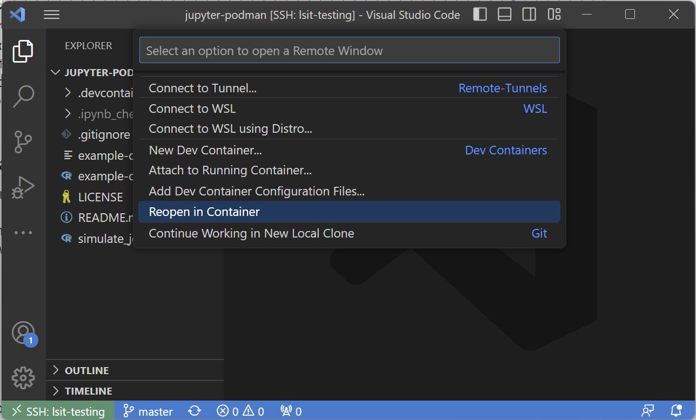
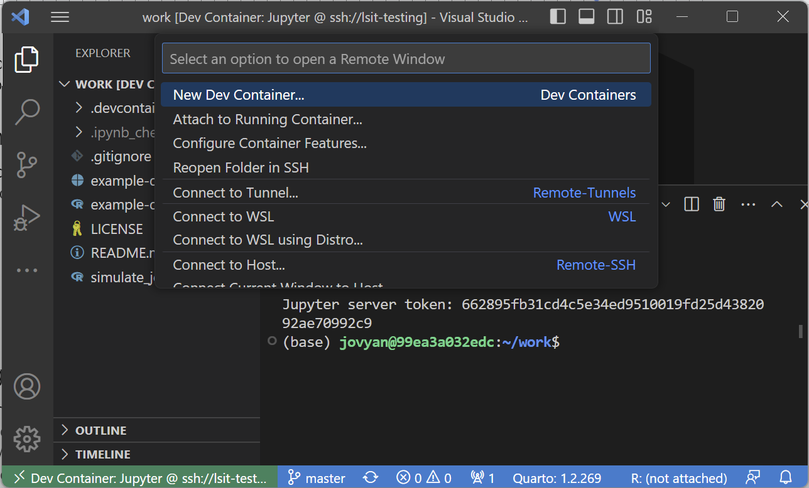
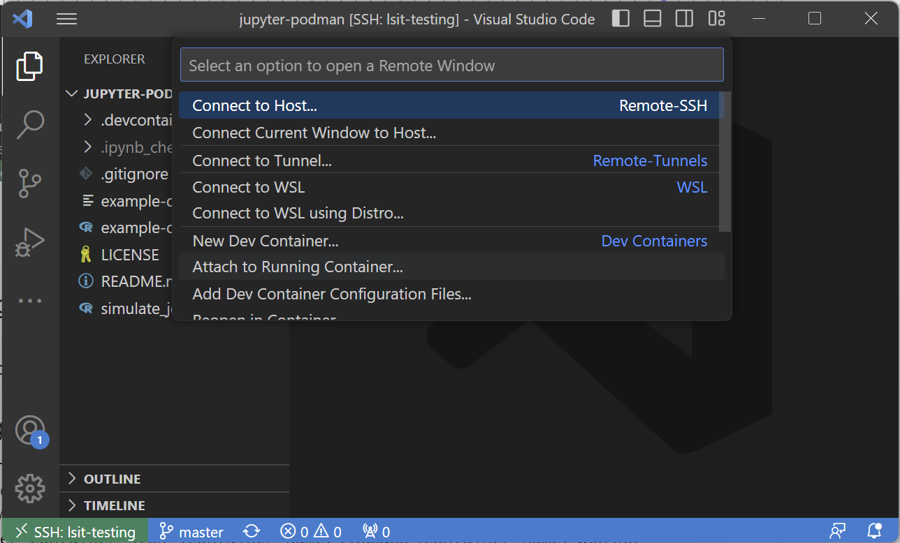

## Introduction

Now that we have a development container setup in place, we can manipulate and use this setup to run our code. This tutorial will cover some basic commands, entering and exiting containers, and shutting down and launching them!

### Prereqs

- Latest version of [Git](https://git-scm.com/downloads)
- A [GitHub](https://github.com/) account
- [VS Code](https://code.visualstudio.com/) text editor
- [Dev container setup](/docs/devcontainer/basic-usage/#2)
- [SSH Setup](/docs/devcontainer/new-accounts/#1) (key generation and GitHub) on the remote server

### Useful Links

[Google Docs Version of Tutorial](https://docs.google.com/document/d/1oTagNdTuDcQMCT3-2vjtK945VB_sJndbnfhoeSxOK24)

## Commands

Now that your dev container is built, let's get familiar with some dev container basics.

Our dev containers use Docker. Docker is a container management tool that allows you to download and store " **images**" that can be built and used as " **containers**". *Images*are effectively small installation objects that contain all the necessary components to set up a specific container with a specific environment. *Containers* are effectively small environments that have just the base essentials to run all the development tooling that is required. Containers are built from images. are effectively small environments that have just the base essentials to run all the development tooling that is required. Containers are built from images.

Here are some basic commands that will be useful to use in terminal:

- `docker images` : lists all available images being tracked by Docker
- `docker ps` : lists all **running** containers along with their status
- `docker ps -a` : lists **all**containers even if they are not running

## Basics

Once your container is built, you will be able to use it for your research or programming. The development container setups provided by the department should be a sufficient starting point. More advanced setups are discussed in the Dev Container Customization tutorial. Here, we will show how to start up, attach, detach, and stop a container.

### Starting a container

To start a container, you can do one of the following:

1. Open a file directory that contains your Docker file and you should see and click the following dialogue pop-up:

2. Or you can click on the bottom left remotes button or using the keyboard shortcut (`ctrl`/⌘ + `shift` + `p` or `F1`) search for "Reopen in Container":

### Detaching from a container

To detach from a running container, click on the bottom left remotes button or using the keyboard shortcut (`ctrl`/⌘ + `shift` + `p` or `F1`) search for "Reopen Folder in SSH" or "Reopen Folder Locally".

Clicking this will detach you from the running container. **However, it will not close the container**.

### Attaching to a running container

To reattach to a running container, click on the bottom left remotes button or using the keyboard shortcut (`ctrl`/⌘ + `shift` + `p` or `F1`) search for "Attach to Running Container...":

From there, you will be given an option to select one of your running containers.

### Stopping a running container

To stop a running container run the following commands:

1. `docker ps` : run this to figure out which container(s) are running. You will see a "NAMES" category, this will be the container name to use in the next command.
2. `docker container stop <container_name>` : replace `<container_name>` with the previous commands output. with the previous commands output.

Running these 2 commands will stop this container as well as any code or services running in it.

### More advanced commands

Docker comes with a swathe of terminal commands to manage containers. More advanced commands will be added in future tutorials.

## File Management

File management in development containers is made simple through VS Code. For all intents and purposes, file management in dev containers is no different than in local or SSH setups.

In essence:

- For **local**file management, files can be moved around either by File Explorer, drag-and-drop into VS Code, or terminal to the dev container folder as needed.
- For **local/remote**file management, files can be drag-and-dropped from*local -> remote*straight into VS Code (assuming SSH is properly set up). To receive files from*remote -> local* each file must be selected and downloaded by right clicking and selecting "Download..." in the VS Code Explorer pane.
- For **remote/remote** file management, the `scp` or `sftp` commands or a GUI tool like WinSCP to transfer between *remote remote*. .

For more information, see the [File Management wiki entry](/docs/devcontainer/file-management/).

## Job Management

With the [default setup](https://github.com/syoh/jupyter-rootless-docker), it is possible to run Python and R via

- Terminal
- Jupyter Notebooks
- RStudio
- Quatro

These tools allow for users to run their code and programs while inside the container. It is recommended to use notebooks (RMarkdown or Jupyter) to run jobs that are possible to complete during a single session.

However, for long running jobs that take many hours or potentially even days to run, it is recommended to use alternative measures to complete these jobs without needing to stay in a dev container session. More information on this can be found in the [Job Management wiki entry](/docs/devcontainer/job-management/). .

**Next up:** continue on to [the related wiki page](/docs/devcontainer#management).