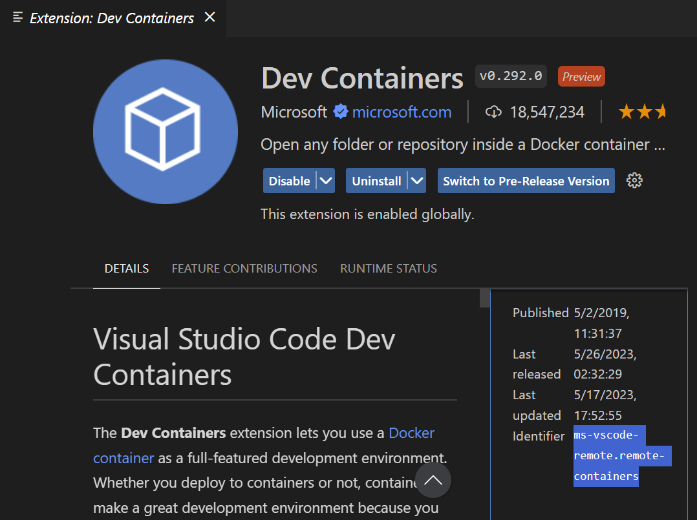
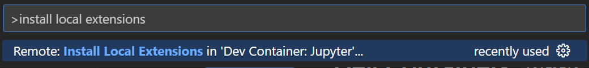

## Introduction

This tutorial discusses in more detail, the parts of a Dockerfile.

### Prereqs

- Completion of [basic container usage](/docs/devcontainer/basic-usage/)

### Requirements for local

- Latest version of [Docker](https://www.docker.com/)

### Requirements for remote

- [SSH Setup](/docs/devcontainer/new-accounts/#1) (key generation and [GitHub](/docs/devcontainer/basic-usage/#6)) on the remote server

### Useful Links

[Google Docs Version of Tutorial](https://docs.google.com/document/d/10Vav5Ug2YKmD5SSm5aurSyP_faW4IS1jV6P9Ad1rZr8)


## Customization Options

Although base container configurations are provided by the department, depending on your needs, you may wish to have a more lean or more bulky setup.

This tutorial will cover the following options:

- Base container images (Task/language specific)
- Adding language packages
- Adding system packages (Ubuntu/Alpine/Alma/etc)
- VS Code extensions and settings
- GitHub dev containers through browser (Codespaces)

**We begin by looking at the following Dockerfile:**[**https://github.com/syoh/jupyter-rootless-docker/edit/main/.devcontainer/Dockerfile**](https://github.com/syoh/jupyter-rootless-docker/edit/main/.devcontainer/Dockerfile)


## Base Container Images

The first part of a Dockerfile contains the base image that should be used to build a container. In our case it is:

```
FROM jupyter/datascience-notebook:x86_64-2023-03-06
```

This image provides a foundation that includes libraries for data analysis from the Julia, Python, and R communities. More information about this image can be found on the [Jupyter Docker Stacks website](https://jupyter-docker-stacks.readthedocs.io/en/latest/using/selecting.html#jupyter-datascience-notebook). .

There are many images out there and all can be found on the [Docker Hub](https://hub.docker.com/search?q=). You can find additional images there to suit your needs.


## Packages

### System

System packages are ones that exist globally on the containerized operating system for you to use. Although Docker images provide most of the essentials, you may find that certain libraries or tools that you use require additional packages to run smoothly. In order to add these dependencies we use the `RUN` command in the Dockerfile, which runs a command as if it is being typed into terminal. command in the Dockerfile, which runs a command as if it is being typed into terminal.

The `jupyter/datascience-notebook` image uses Ubuntu as its base container OS. As such, we have access to the `apt` package manager.

For instance, the following commands:

1. Download the necessary RStudio package
2. Install it without prompt (-y) and without output (-q)
3. Remove the downloaded package and clean up the installation cache
4. Makes sure that RStudio Server has read, write, execution privileges

```
RUN wget -q https://download2.rstudio.org/server/jammy/amd64/rstudio-server-${R_STUDIO_VERSION}-amd64.deb && \ # 1. apt-get install -yq --no-install-recommends ./rstudio*.deb && \ # 2. rm -f ./rstudio*.deb && \ # 3. apt-get clean && \ # 3. chmod 777 /var/run/rstudio-server && \ # 4. chmod +t /var/run/rstudio-server # 4.
```

Some available options with this particular Dockerfile is to remove the lines for Quatro and RStudio if only Python will be used for development.

### Language

Language specific packages can be installed using the `RUN` command followed by the specific language package manager (such as pip, mamba, conda). In the case of R, we must run `RUN R -q -e ‘install.packages(‘package-name-here')'` inside the Dockerfile. An example of this can be found on these lines which install packages necessary for RStudio development:

```
RUN pip install radian && \ R -q -e 'install.packages(c("markdown", "languageserver", "httpgd"), repos="cloud.r-project.org")' &&\ R -q -e 'remotes::install_github("ManuelHentschel/vscDebugger")'
```

### Environment Variables

Sometimes, certain installations require setting PATH variables or other environment variables. To do so, we use the `ENV` keyword. keyword.


## VS Code Extensions/Settings

To add VS Code Extensions and Settings, we use the [devcontainer.json](https://github.com/syoh/jupyter-rootless-docker/blob/main/.devcontainer/devcontainer.json) file to specify what we need. Although we can add extensions manually using VS Code, we can also pre-specify them to be automatically installed when creating a development container.

To specify them, we need to look them up in the VS Code Extension menu (`ctrl`/⌘ + `shift` + `X`) and look for the "Identifier" tag as seen in the lower right corner below:




Another option is to open up the command palette (`ctrl`/⌘ + `shift` + `P`) and search for the following:




Which will simply install your favorite extensions from your local machine's session onto your remote/dev container session.


**Next up:** continue on to [the related wiki page](/docs/devcontainer#additional-features).