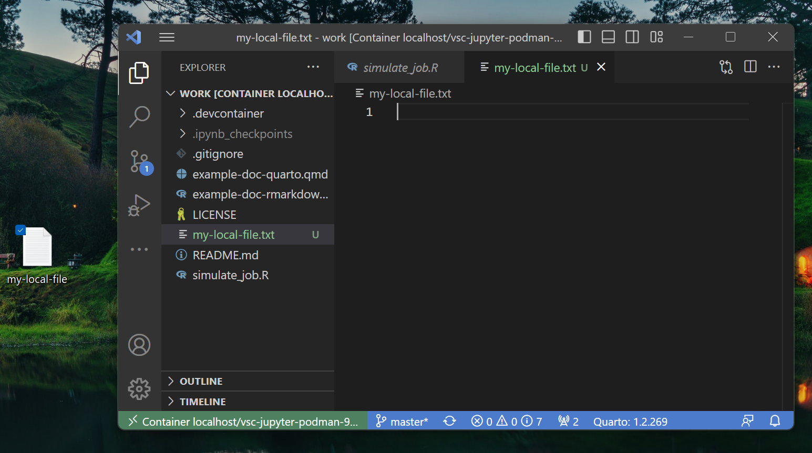
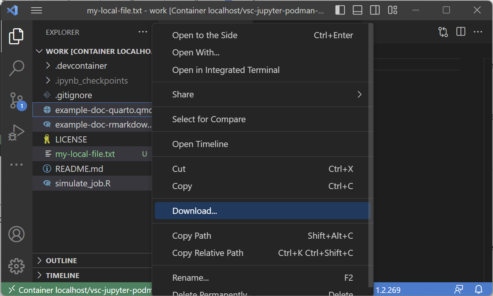
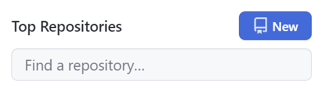
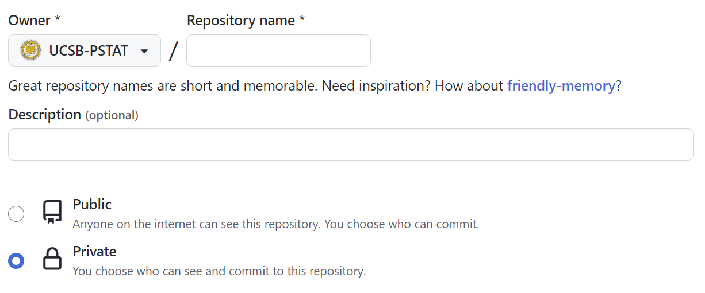
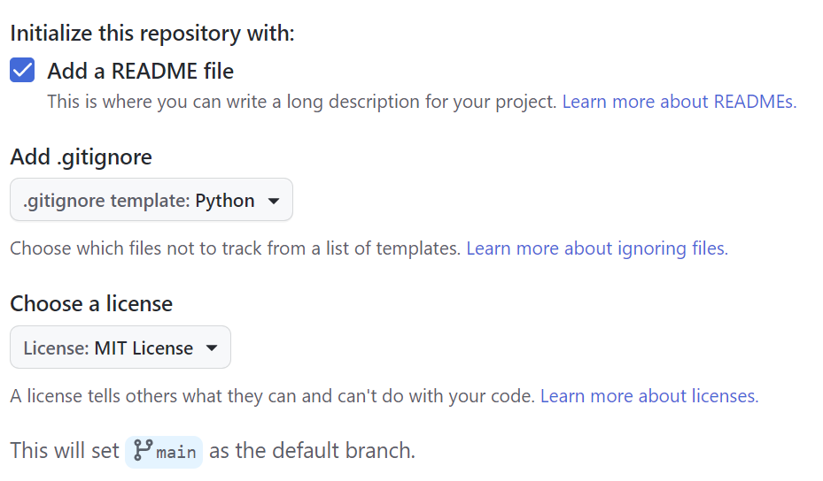
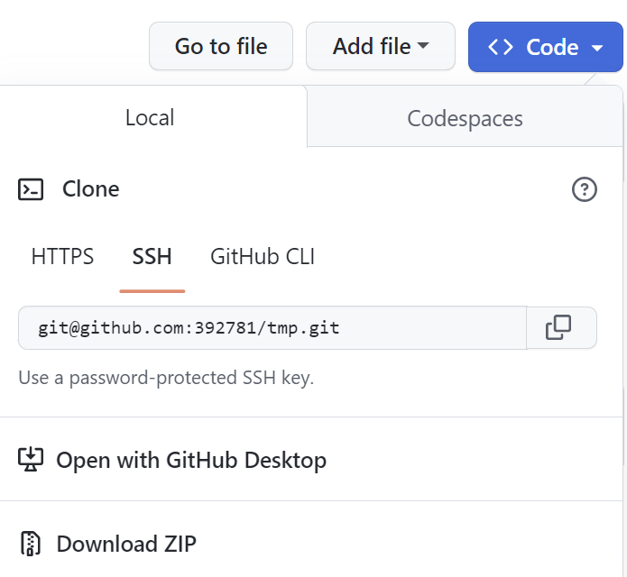
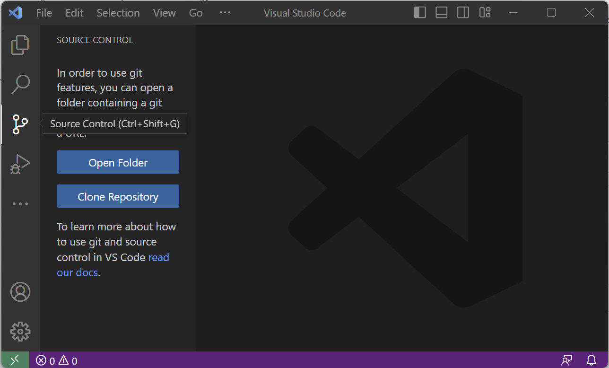
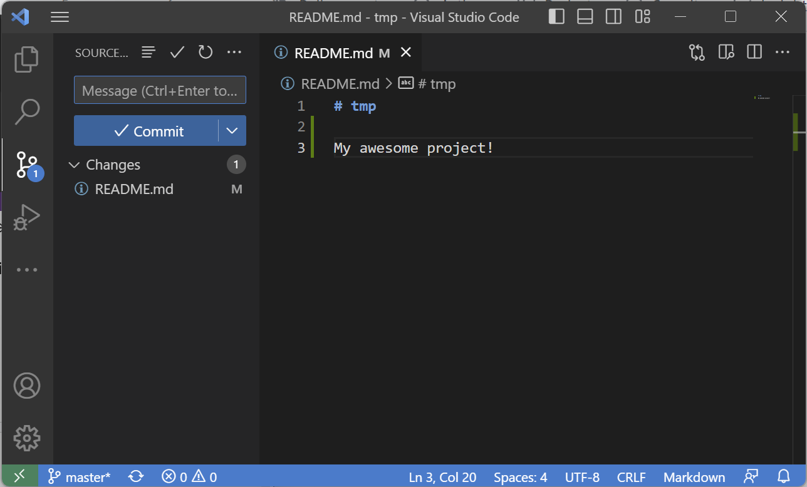

## Introduction

When building up your project directory, you want to be sure that you have access to all your files. This is especially important when working in a remote server environment. This tutorial will cover how to use VS Code to manage your files with ease!

### Prereqs

- [VS Code](https://code.visualstudio.com/) text editor
- (Optional) Completion of [SSH Setup](/docs/devcontainer/new-accounts/#1) ([including GitHub](/docs/devcontainer/basic-usage/#6))

### Requirements for remote

- [SSH Setup](/docs/devcontainer/new-accounts/#1) (key generation and [GitHub](/docs/devcontainer/basic-usage/#6)) on the remote server

### Useful Links

[Google Docs Version of Tutorial](https://docs.google.com/document/d/1OZoi8dN7lrQDSSvWCPuMv8nvMI7W8OV3j02xwb5M7Fg)


## Local

Local file management both inside and outside dev containers can be done through:

- Using a file explorer
- Dragging and dropping files in and out of VS Code's Explorer
- File management through terminal


## Local ↔ Remote

### Local → Remote

To move files from local to remote, we can simply drag and drop files into VS Code's explorer to transfer them to the remote server we're working on:




### Remote → Local

In order to get files from your remote server onto your local machine, first select the files you wish to move and then right-click to "Download..." them into your desired location:




## Git/GitHub Repository Management

It is recommended to manage your work through a version control tool like `git`. You can use `git` to upload your work to a remote repository hosted on GitHub. GitHub is also an excellent way to provide reproducible code and manage code bases of teams with multiple researchers.

This portion of the tutorial will go through setting up a simple git repository that is linked to one hosted on your GitHub.

### Initial Setup

In our initial setup, we need to configure your git username and email address:

```
git config --global user.name "YOUR_NAME" git config --global user.email "YOUR_GITHUB_EMAIL"
```

`YOUR_NAME` and `YOUR_GITHUB_EMAIL` should be set appropriately. To verify that they've been set, simply use the following commands:

```
git config --global user.name git config --global user.email
```

### Creating your first repository

1. Navigate either to your GitHub homepage or user page and click to create a new repository:




2. Choose a repository name, description and whether you want it to be public or private:




3. Select "Add a README file", choose a .gitignore template for the language you will program in (if you wish), and lastly add a license (if you wish):




4. Click the "Code" button in the new window and select "SSH" copy the link:




5. Using the link, open up VS Code and select the "Source Control" pane either by clicking or using the keyboard shortcut (`ctrl`/⌘ + `shift` + `g`):




6. Click "Clone Repository". Paste the GitHub link you copied earlier and press enter. Follow the prompts and open the repository in VS Code.
7. You can now use VS Code to manage your remote repository through the "Source Control" pane:




In order to manage your changes, you must first "Stage" them for commit from your "Changes" drop down. Once you do that, write a commit message, press commit, and lastly press "Sync Changes" to push your changes to the remote repository. The version control workflow can be summarized as follows:

- Add changes to be staged
- Commit changes
- Push changes to remote

In addition to this, we can also pull changes that were committed from another computer or another person through a "pull" action of syncing.

{: .warning }
**Note:** VS Code does a good job of managing most common version control management issues through its GUI interface. That said, ll the actions described have an equivalent terminal command through git. It is a good idea to be comfortable with managing your repository through terminal if things go wrong.


**Next up:** continue on to [the related wiki page](/docs/devcontainer#management).