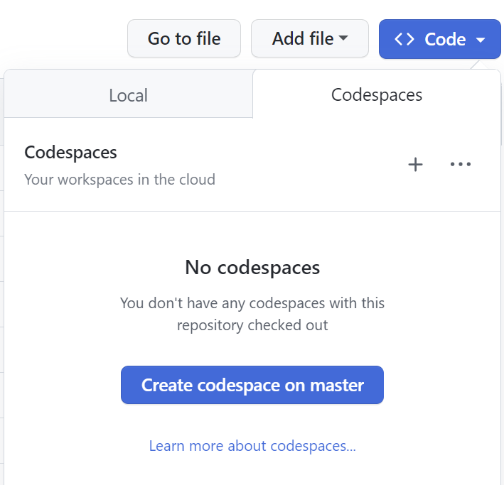
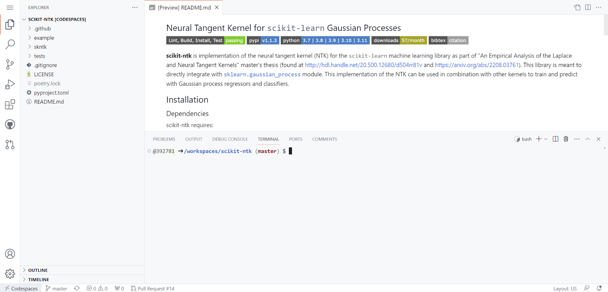
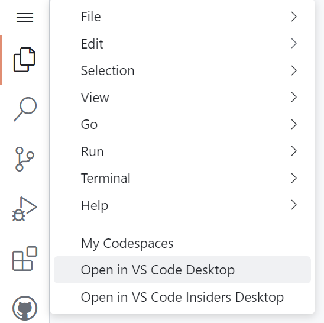
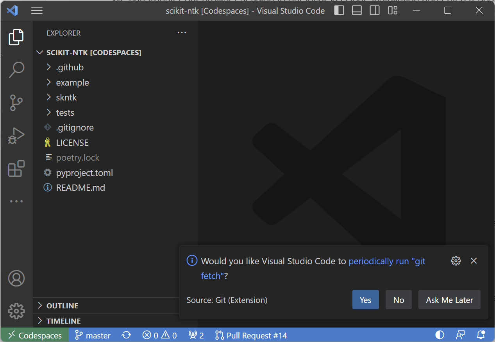
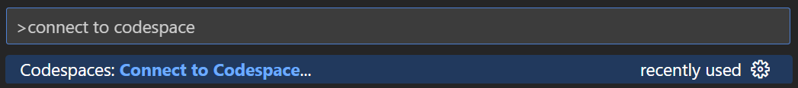
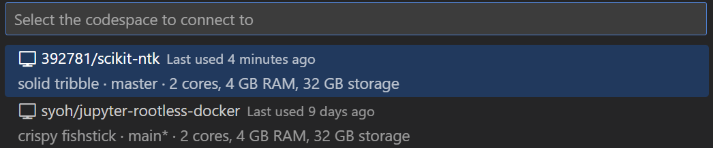

## Introduction

GitHub Codespaces is a browser based form of editing repositories in a browser instance of VS Code. The additional benefit of this is that Codespaces make use of an existing Dockerfile to setup the codespace for development. This allows for quick setup of temporary environments in which you can edit and preview code before configuring your own local/remote setup.

### Prereqs

- Installation of [GitHub Codespaces](https://marketplace.visualstudio.com/items?itemName=GitHub.codespaces) extension on VSCode

### Useful Links

[Google Docs Version of Tutorial](https://docs.google.com/document/d/13FwlQ6xvDvPmxwy4Xs_DCEc-AdEoiMLyurkk7ymxn9s)

## GitHub Developer Pack

In order to make use of codespaces, you must first sign up for the [GitHub Student Developer Pack](https://education.github.com/pack). This gives students access to a myriad of paid tools for free, including codespaces. To sign-up, you must provide your UCSB email address and answer some basic questions. Once you have confirmed your enrollment, continue to the next step.

## Running Codespaces

To run codespaces, all you need to do is access any repository on GitHub and follow these steps:

1. Click on the "Code" button

2. Inside, select "Codespaces":

3. Click "Create codespace on ". This will take you to a separate page which will setup a browser instance of VS Code and potentially install any dependencies that repository has for you automatically!

{: .note }
You can now make changes to the repository and run code as you see fit!

## Transferring to VS Code

We can transfer our browser session to our local VS Code installation and edit a repository from a codespace contained in our local development environment. This is done by clicking on the hamburger menu on the browser and clicking "Open in VS Code Desktop":

This may launch a dialogue box in the browser. Confirm and allow access on VS Code and any firewall application that pops up. This will then launch your remote codespace from within your local VS Code installation which can be seen on the bottom left corner:

## Opening Codespaces from VS Code

We can also open codespaces from inside VS Code. **This will only work if you have previously created a codespace.** Simply hit `ctrl`/⌘ + `shift` + `P` to open the command palette and search for "Connect to Codespace":

This will open a selection of available codespaces. Select one to run it in VS Code:

## Development Containers

If a repository contains a development container directory with a Dockerfile, codespaces will automatically build the container for you to use. This is an automated process and requires no additional setting up.

Take note that this will only be available for basic programming. Do not expect to run hefty experiments within a codespace instance. This should be used for quick file editing, debugging, and testing. For more permanent solutions, use either a local or remote development container setup.

**Next up:** continue on to [the related wiki page](/docs/devcontainer#additional-features).