## Introduction

It is simple enough to edit and run files while in a remote environment; however, when dealing with big data or computationally intensive procedures you may want to work on something else or even turn off your computer to go to bed. The worst is when you're running a program and you disconnect due to connection issues.

To solve this problem, this tutorial will cover how to run your jobs *in the background* using `tmux`!

### Prereqs

- [VS Code](https://code.visualstudio.com/) text editor
- [Dev container setup](/docs/devcontainer/basic-usage/#2)
- [SSH Setup](/docs/devcontainer/new-accounts/#1) (key generation and [GitHub](/docs/devcontainer/basic-usage/#6)) on the remote server

### Useful Links

[Google Docs Version of Tutorial](https://docs.google.com/document/d/1yF0US6nskeKtxQ8an5zFTD3OvLwK6Eg2aI2ZcDiqKB0)

## Jobs

Running long jobs on your machine of choice can be cumbersome since it requires maintaining an active session (staying logged on, keeping laptop powered on, disabling hibernation, etc.). Fortunately, this can be alleviated by running jobs on a remote server using tmux ( [terminal multiplexer](https://github.com/tmux/tmux/wiki)). tmux allows you to run a job while being able to disconnect from a container *and* from the server. You power off your computer, come back, and reattach to your running job. from the server. You power off your computer, come back, and reattach to your running job.

Although tmux is used for more than job management, we will discuss the basic usage in regards to job management. For more advanced features please view the tmux [wiki](https://github.com/tmux/tmux/wiki). .

{: .warning }
**Note:** It is not recommended to use notebooks (Jupyter/RMarkdown) to run long jobs. There are some basic reasons for this: It is difficult to reattach to a notebook session once you disconnect your server connection. In the event that reattachment is possible, notebook output and job status (running/stopped/errors/etc.) cannot be recovered. As a result, it is highly recommended to use tmux for long job management!

## Basics

1. Open up VS Code, connect to a remote server, and run your docker container.

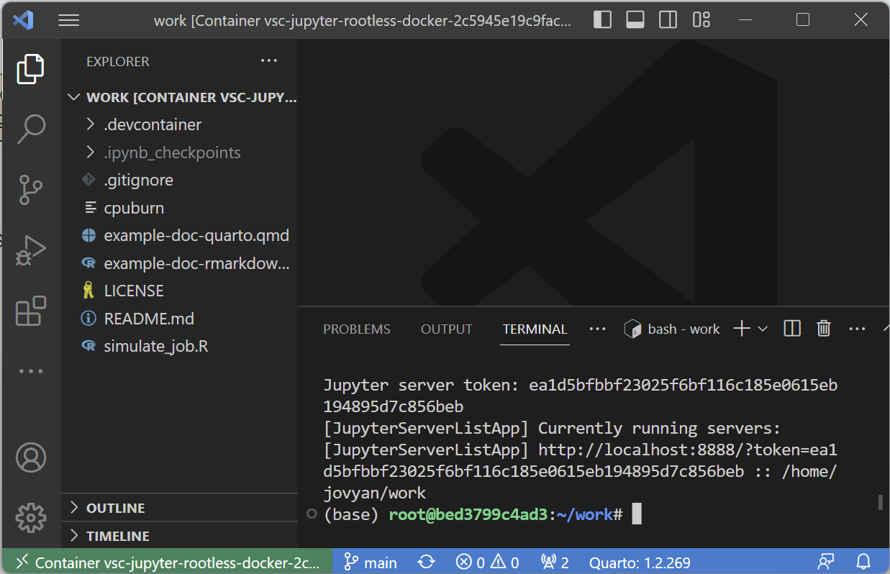

2. Make sure that a terminal session is open. Inside terminal type in `tmux` and press enter. This will open up a tmux session which is no different than your regular terminal but with additional features. and press enter. This will open up a tmux session which is no different than your regular terminal but with additional features.

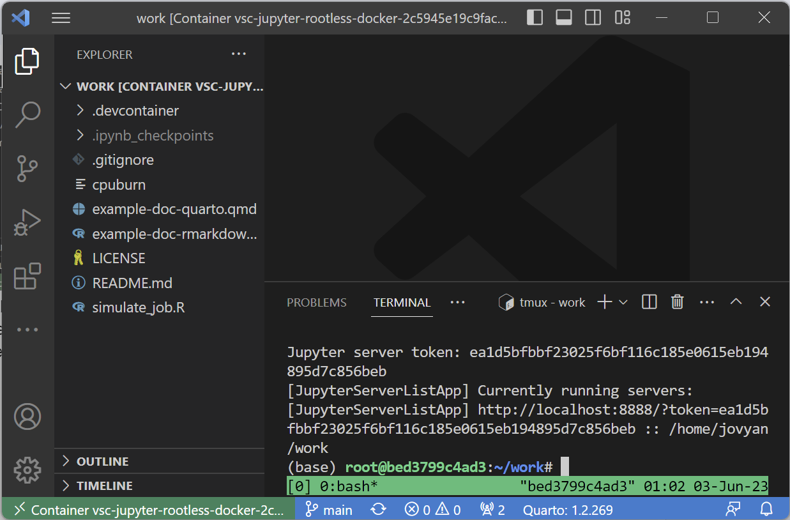

3. We just created a new tmux session. We can do tasks in it, run programs, or run code. For now, we will detach from the session using `tmux detach` **or** the keyboard shortcut `ctrl`/⌘ + `b`, `d` (2 steps: "control" and "b" together followed by "d" by itself). Detaching means that we are leaving the tmux session **but** leaving any jobs/programs running in the background within that session. leaving any jobs/programs running in the background within that session.

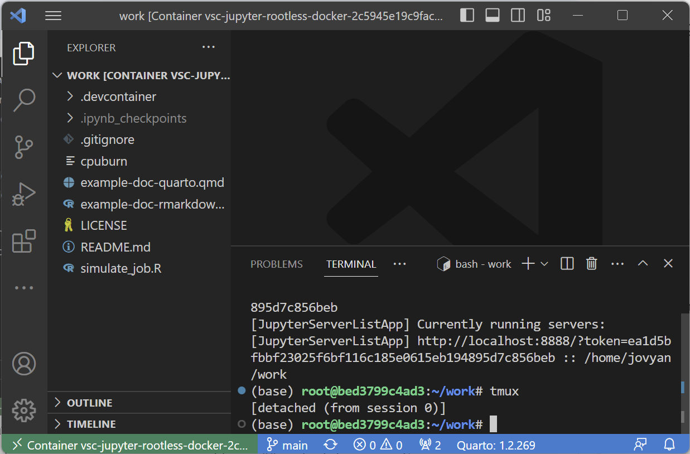

4. To reattach to the most recent session, we can simply type `tmux attach`:

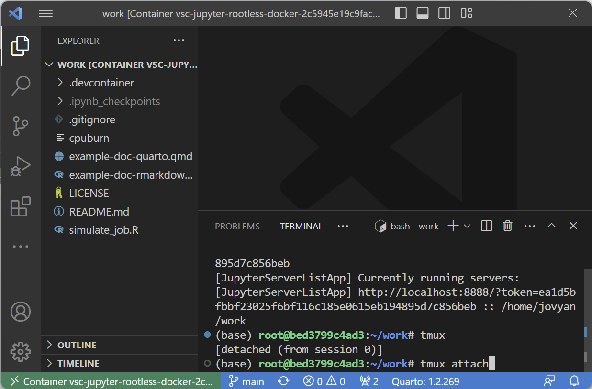

5. To view all current running sessions we can use `tmux ls`. We only have 1 session called "0" with 1 window open:

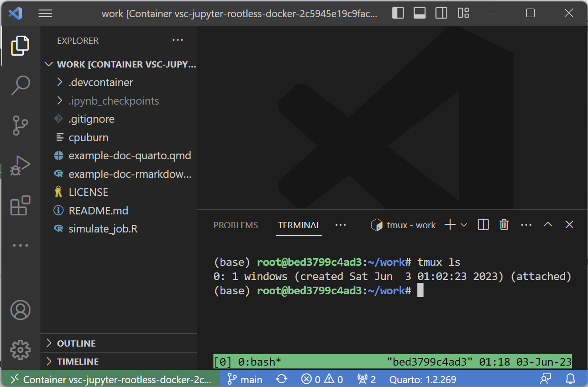

6. If you create more than one tmux session, we can specify which one we wish to connect to by adding the `-t` flag for the following command: `tmux attach -t <name/number>` where name/number can be found on the left-most output of `tmux ls`:

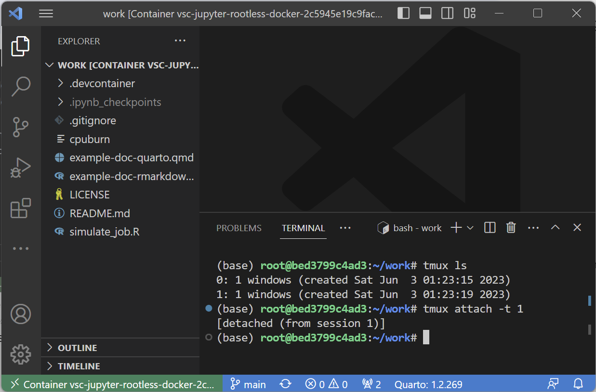

7. To kill a specific session and any running jobs within it, we use the `kill-session` command: `tmux kill-session -t <name/number>`: :

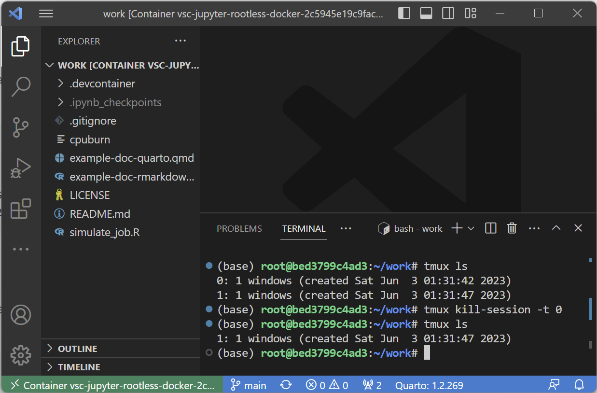

8. To kill all sessions and any running jobs in it we use `tmux kill-server`. This will end all tmux sessions.
9. Lastly, if you want your session to be named something other than a number you can use `tmux new -s <name>`: :

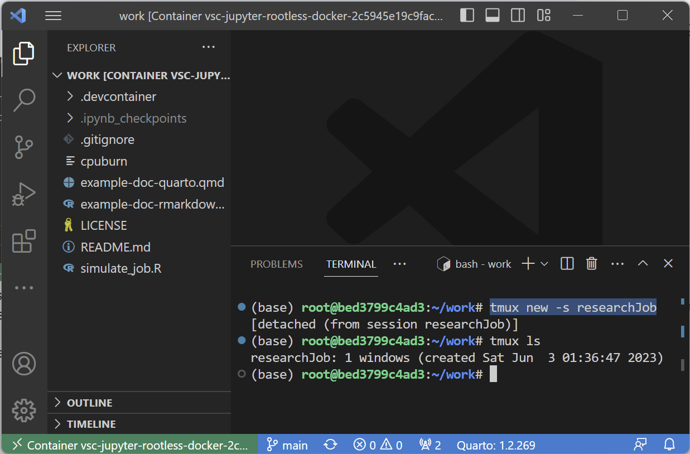

## Running Background Jobs

Let's start fresh by running `tmux kill-server` and running `tmux` to create a new session:

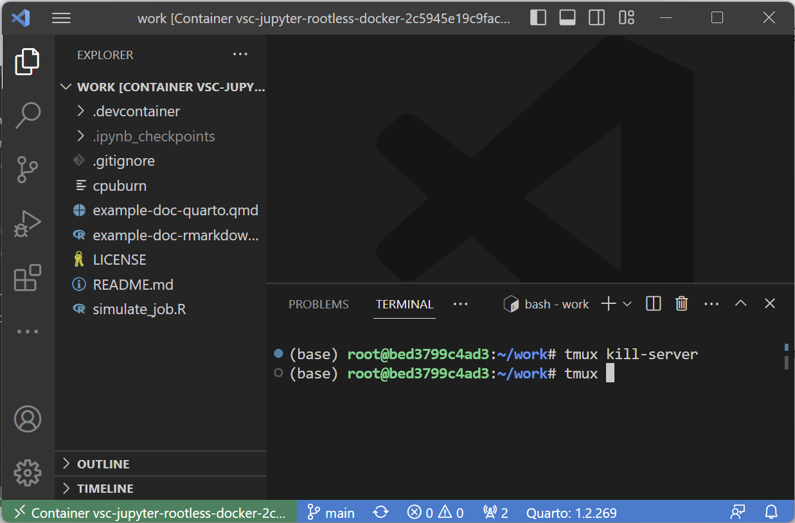

This will attach us to a new tmux session as discussed. As an example, we will use the `simulate_job.R` file to run a long job within the tmux session. This will create an empty file in a folder every 10 seconds:

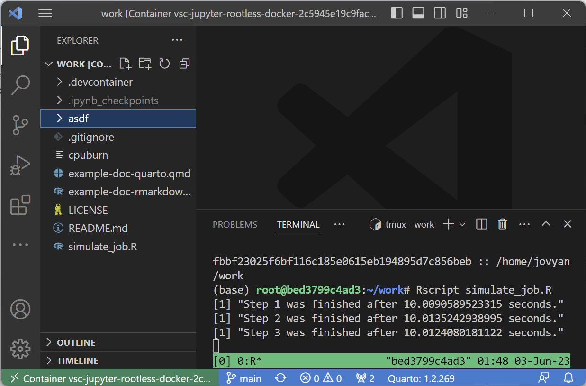

Now, let's detach from the tmux session using our keyboard shortcut `ctrl`/⌘ + `b`, `d` as shown in step 3 in the previous page. This will detach our session back to our main terminal. From here, we are free to detach from the dev container *and* from our remote server!

{: .warning }
**Note:** In order for this to work, you must keep your dev container running on the remote server. If you kill your dev container session, it will also kill anything that is happening within it.

We are free to shut down our computer and come back to it whenever we please. In order to retrieve our job(s), we need to:

1. ssh into the remote server

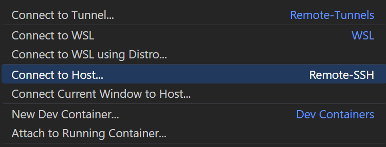

2. Attach to the running dev container (or use the "Reopen in dev container" pop-up)

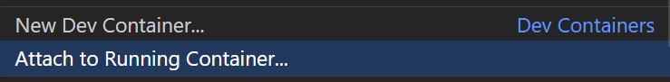

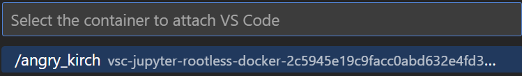

3. Run either `tmux attach` (for the most recent session) or `tmux ls` and `tmux attach -t <name/number>` (to find a specific session and attach to it):

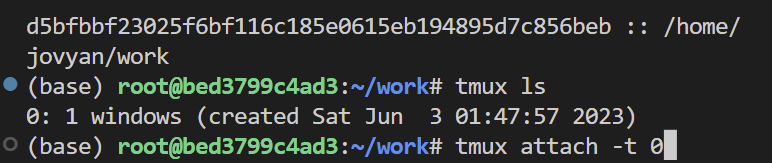

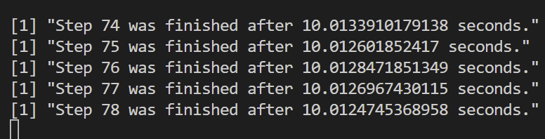

{: .note }
**Success!** We have accessed our long running job! If we want to kill the job midway through we can use `ctrl`/⌘ + `c` to interrupt the job: 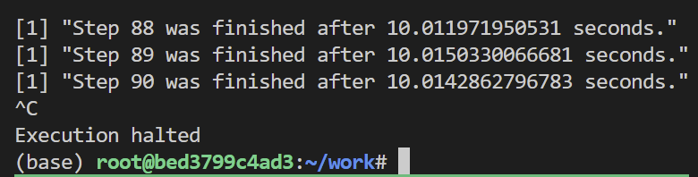 Otherwise, you are now ready to run jobs in the background using tmux!

## Advanced Features

tmux is much more than a way to run and recover jobs in the background. There are many keyboard shortcuts and customizability features that are available. Specifically, tmux can:

- Run multiple terminal panes in a single window,
- Run multiple windows in a single session.

This means that instead of needing more than one tmux session, we can add additional windows or additional panes as needed. Below is an example of 3 panes in a single window of a tmux session:

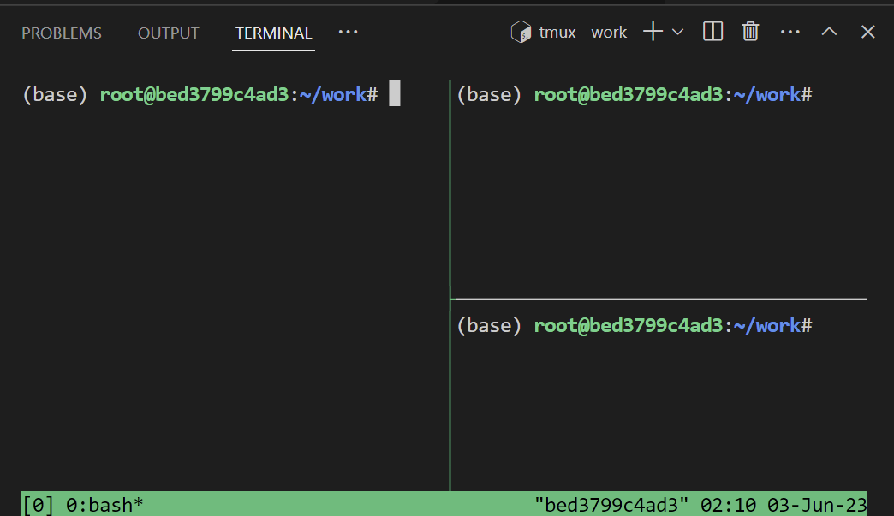

These features, as well as additional configuration and customization can be found in the [tmux wiki](https://github.com/tmux/tmux/wiki/Getting-Started).

**Next up:** continue on to [the related wiki page](/docs/devcontainer#management).