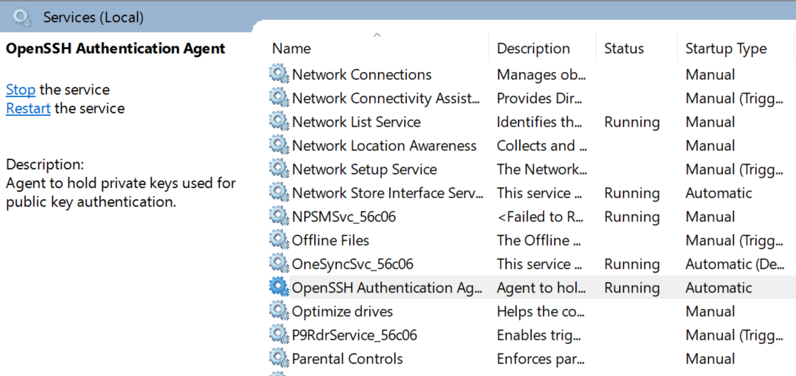
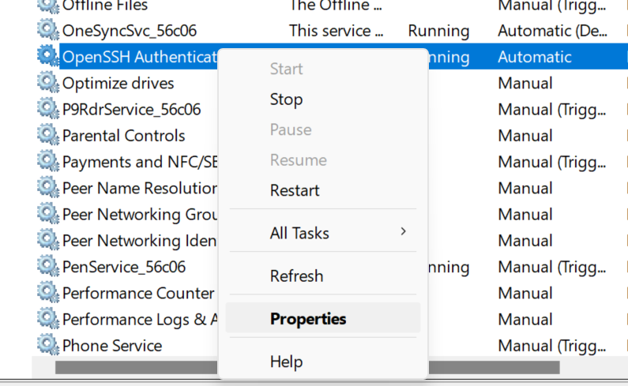
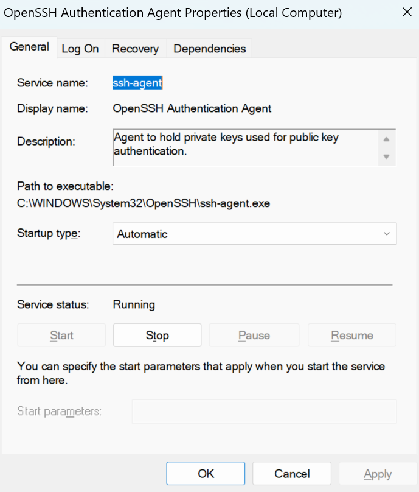
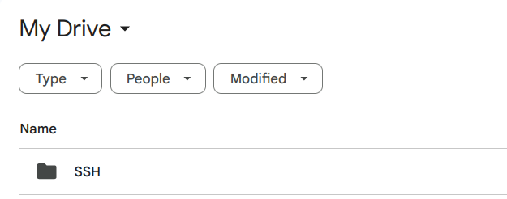
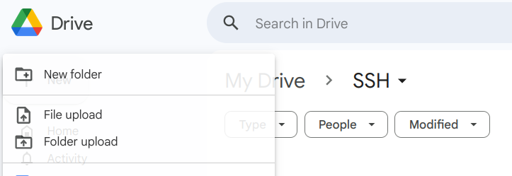
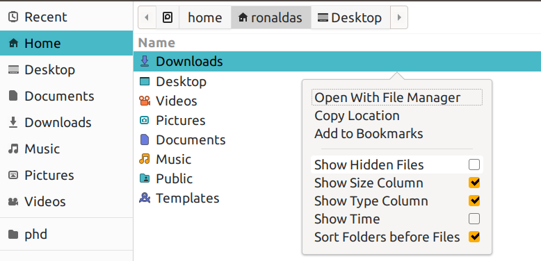
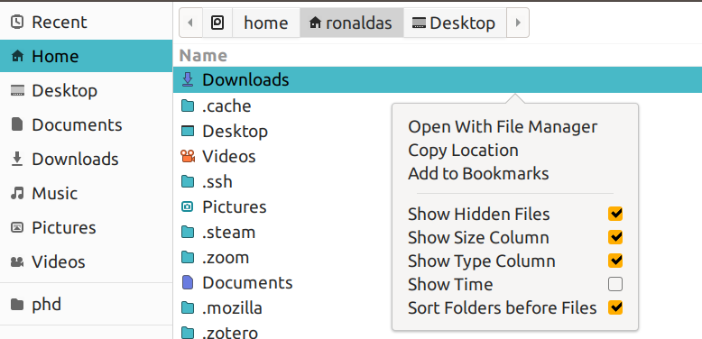
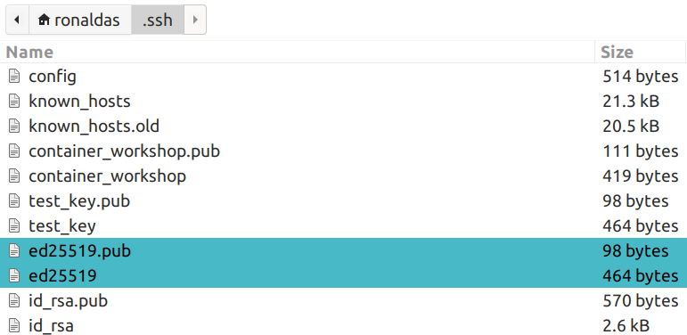
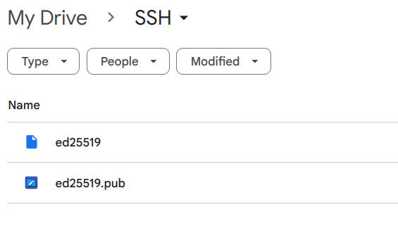

## Introduction

In this tutorial, you will go through the user sign-up process for a PSTAT user account for server access. This will require you to generate a SSH key for your machine.

**If you run into any issues, please ask for help in the**[**PSTAT Research Computing Users**](https://chat.google.com/room/AAAAR6wMcN0?cls=7)**Google Group!**

### Prereqs

- [VS Code](https://code.visualstudio.com/) text editor

### Useful Links

[Google Docs Version of Tutorial](https://docs.google.com/document/d/1yNjoAO0xFMkQggEahwrprr5M9XVejFK21hVx1MhzoMc)


## Generating Keys - Windows

**These steps are for Windows machines only.**

1. Press Start and search for "Windows Powershell". Click on it to open a new shell.
2. Next, run the following code to create a directory called `.ssh`.

```
new-item $HOME\.ssh -ItemType Directory
```

{: .warning }
**Note:** You may get an error saying "new-item : An item with the specified name ...\.ssh already exists.". If you do, you can proceed to the next step since the directory is already there!

3. In the terminal either type or copy-paste the following command:

```
ssh-keygen -t ed25519 -f $HOME\.ssh\ed25519
```

**You will be prompted to add a password to this key... Use something that is secure and memorable (or ideally something you can store in your password manager)!**The command above will generate 2 files in the directory `C:\Users\<your username>\.ssh\`: `ed25519` (private key) and `ed25519.pub` (public key).

{: .warning }
You should keep your private key safe, **do not share it with anyone!**

4. Verify that ssh-agent is running by searching for "Services" in the Start Menu:


5. Search for "OpenSSH Agent" and make sure that the **Status is "Running"** and **Startup Type is "Automatic"**.




6. If this is not the case, right-click on the "OpenSSH Authentication Agent" entry -> select "Properties" -> Under "Service Status" select "Start" -> From the "Startup Type" drop down menu, select "Automatic".







7. Lastly, verify that your private key is added to your ssh-agent keyring by typing the following command in terminal where `<KEY_NAME>` is the name of the key you created earlier. **Enter the password that you created earlier!**:

```
ssh-add $HOME\.ssh\ed25519
```


## Generating Keys - macOS/Linux

**These steps are for macOS/Linux machines only.**

1. Find your terminal application and open up a new shell:

- macOS: cmd + space, then search "terminal"
- Ubuntu: ctrl + alt + t

2. In the terminal either type or copy-paste the following command:

```
ssh-keygen -t ed25519 -f ~/.ssh/ed25519
```

**You will be prompted to add a password to this key... Use something that is secure and memorable (or ideally something you can store in your password manager)!**The command above will generate 2 files in the directory `~/.ssh/`: `ed25519` (private key) and `ed25519.pub` (public key).

{: .warning }
You should keep your private key safe, **do not share it with anyone!**

3. Verify that your ssh-agent is running by using the following command:

```
eval "$(ssh-agent -s)"
```

{: .warning }
**Note:** Depending on your shell, you may need to use a different command or use elevated privileges through `sudo`. More details can be found in this [link](https://docs.github.com/en/authentication/connecting-to-github-with-ssh/generating-a-new-ssh-key-and-adding-it-to-the-ssh-agent?platform=linux#adding-your-ssh-key-to-the-ssh-agent).

4. Lastly, verify that your private key is added to your ssh-agent keyring by typing the following command in the terminal where `ed25519` is the name of the private key you created earlier. **Enter the password that you created earlier!**:

```
ssh-add ~/.ssh/ed25519
```


## Saving the Keys

Once you have generated your keys, you should upload them onto Google Drive. This way, you can add new devices or update device access if you ever lose access to your original keys stored on this laptop/desktop.

1. Create a folder on your Google Drive. You can name it whatever you wish, in this case I named mine "SSH":




2. Enter the folder and hit the "+ New" button on the left handside of your screen and select "File Upload":




3. Go to your "Home" directory. For Windows users this should be the location `C:\Users\your_user_name\` and for Linux/Mac users it will be `/home/your_user_name/`. **You may need to select a "Show Hidden Files" option regardless of your operating system in order to use the .ssh folder!**

 


4. Go inside the ".ssh" directory. Select the ed25519 and ed25519.pub files and upload them:







{: .note }
You will use these keys in the event that you need to add new devices or lose access to your SSH keys via [the steps found here](/docs/devcontainer/new-devices//).


## User Signup Form

Now that you have your public and private keys, [complete the following user sign-up form](https://forms.gle/itW7UYAprEHwc9tr7). In the last step where you're asked to input your *public key*, do the following (this step uses your installation of VS Code):

1. Go back to your terminal and use the following command:

**Windows:**

```
code $HOME\.ssh\ed25519.pub
```

**macOS/Linux:**

```
code ~/.ssh/ed25519.pub
```

2. This will launch a VS Code window containing your public key. Copy and Paste the key into the last step of the Alta user sign-up form.

{: .warning }
**Note:** Make sure that you are selecting your **.pub** key... this is your public key and should look something akin to this: `ssh-ed25519 AAAAC3NzaC1lZDI1NTE5bbbAIIZu4CLClaJ3Iasdfn+wT61hRJJ1RfnLfkdba6SVISq ron@wheeler`

3. Once you've completed the form, **please send a message in the**[**PSTAT Research Computing Users**](https://chat.google.com/room/AAAAR6wMcN0?cls=7)**group to confirm your completion!**

{: .note }
Congrats! This completes the SSH key creation portion of the tutorial. **Note:** It will take some time for accounts to be set up so in the meantime hang tight and wait for more details! In the meantime, go onto the next step to install some important VS Code extensions.


**Next up:** continue on to [the related wiki page](/docs/devcontainer#setup).