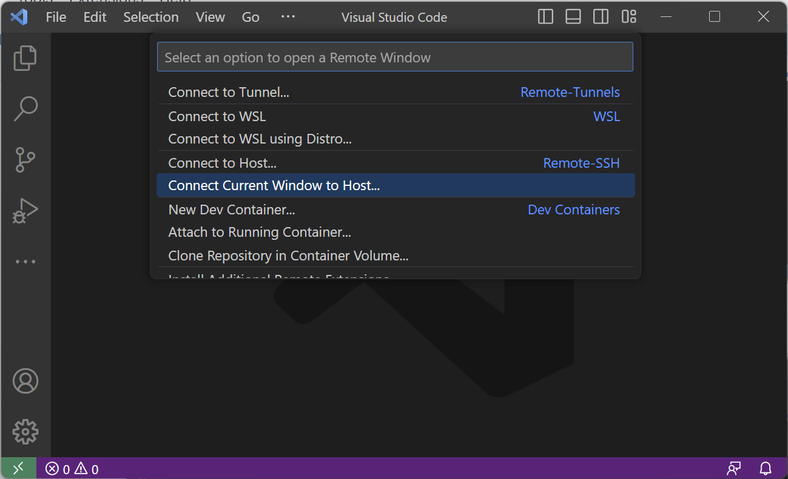
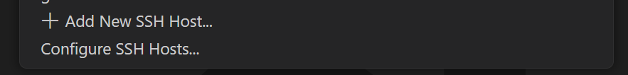

## Troubleshooting Connection Issues

{: .warning }
**If you run into any problems connecting, try the following steps!**

### Useful Links

[Google Docs Version of Tutorial](https://docs.google.com/document/d/1ocxp6zUY1p7BprscQii7zyyu0F0jJx281MC5JOXvSVg)


### Connecting to Host Asks for a "Password"

This may mean that your ssh-agent was configured incorrectly. Use the following commands inside your terminal to determine any errors and report back to the [PSTAT Research Computing User Group](https://chat.google.com/room/AAAAR6wMcN0?cls=7) for further assistance.

1. Verify that ssh-agent is running. This will return something like `Agent pid ...`:

```
eval $(ssh-agent)
```

2. Now verify that your private ssh key is added to your ssh keyring. This will return something like `Identity added: ...`:

```
ssh-add $HOME/.ssh/ed25519
```

{: .warning }
**Note:** Depending on how you setup your SSH keys, you may need to enter a passphrase. If you set a passphrase, enter it at this step.

3. Double check that your `ed25519` was added to your keyring. This will return something like `256 SHA256: ... user@host (ED25519)`:

```
ssh-add -l
```

4. Lastly run this oneliner where `user` and `hostname` are the respective values for the server you are trying to connect to (e.g. for Alta it would be `NETID@alta.pstat.ucsb.edu`) which should return **nothing**.

```
ssh user@hostname exit
```

5. If all of these options worked and you are still having trouble connecting to your server, you may need to add an `IdentityFile` section to your ssh config as follows by first "Connecting Current Window to Host":




6. Select "Configure SSH Hosts..."




7. Select your default configuration file to update (under your computer's username):


8. Specify an `IdentityFile` which will be the name of the private key (`ed25519`). An example of your final configuration for Alta should look similar to this:

```
Host alta HostName alta.pstat.ucsb.edu User YOUR_NETID_HERE IdentityFile ed25519
```

{: .warning }
**Note:** For `IdentityFile` you may need to enter a more complete path such as a relative path (`$HOME/.ssh/ed25519`) or your full path (`/home/your_user_name/.ssh/ed25519` (mac/linux) or `C:\Users\your_user_name\.ssh\ed25519` (Windows))


**Next up:** continue on to [the related wiki page](/docs/devcontainer#setup).